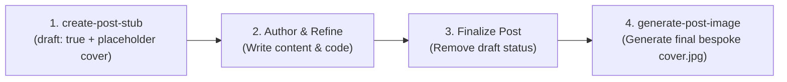

# Create Post Stub

This skill scaffolds a new blog post draft on [bwrob.dev](https://bwrob.dev) with proper
naming conventions, draft status, structured outline, and a 900×600 placeholder cover
image.

---

## Post Lifecycle Overview



> [!IMPORTANT]
> **Do not generate custom cover art during stub creation.** The stub uses the bundled
> placeholder cover image. Custom AI image generation must be deferred until the post
> content is complete and the post is undrafted.

---

## Workflow Steps

### 1. Gather Post Metadata

Determine or ask for:

* **Topic / Working Title**: e.g., "Fast IPC with PyArrow"
* **Slug**: kebab-case identifier (e.g., `fast-ipc-pyarrow`)
* **Categories**: e.g., `[Dev Env]`, `[Python Recipes]`, `[Data Science]`, or
  `[Financial Markets]`
* **Brief Description**: 1–2 sentences summarizing the post.

### 2. Determine Folder Name & Date

Follow the blog's date-prefixed folder naming convention:

* Current ISO date: `YYYY-MM-DD` (e.g., `2026-09-21`)
* Folder prefix: `YY-MM-DD-<slug>` (e.g., `26-09-21-fast-ipc-pyarrow`)
* Destination: `posts/<YY-MM-DD-slug>/`

```bash
POST_DATE=$(date +%Y-%m-%d)
FOLDER_PREFIX=$(date +%y-%m-%d)
POST_DIR="posts/${FOLDER_PREFIX}-${SLUG}"
mkdir -p "$POST_DIR"
```

### 3. Install Placeholder Cover Image

Copy the bundled 900×600 Tokyo Night placeholder cover to the post directory:

```bash
cp .agents/skills/create-post-stub/resources/placeholder-cover.jpg "$POST_DIR/cover.jpg"
```

> **Rule**: The cover image must **always** live directly inside the post directory and
> be named `cover.jpg`.

### 4. Create `index.qmd`

Create `posts/<YY-MM-DD-slug>/index.qmd` with the following structure:

```yaml
---
title: "Your Post Title"
description: "A short, engaging description of the post topic."
date: "YYYY-MM-DD"
date-modified: "YYYY-MM-DD"
draft: true
categories: [Dev Env]
image: cover.jpg
format-links: [html]
toc-depth: 2
---

{width="98%" fig-align="center"}

Opening hook paragraph introducing the problem, tool, or pattern. Explain why this
matters to developers and what the post demonstrates.

## Overview & Motivation

Provide background context. Why does this challenge arise? What alternatives exist?
Outline the architecture, tool, or design choice being explored.

## Implementation & Walkthrough

Step-by-step technical breakdown. Include concrete commands, configuration snippets,
or Python code:

```python
def main() -> None:
    """Demonstrate the core pattern."""
    pass
```

Explain the code mechanics, key arguments, and non-obvious nuances.

## Key Takeaways

* Core summary point 1.
* Core summary point 2.
* Relevant documentation or GitHub links.

```text

### 5. Verify the Stub

1. Check that `posts/<YY-MM-DD-slug>/cover.jpg` exists and is 900×600:

   ```bash
   file posts/<YY-MM-DD-slug>/cover.jpg
   ```

2. Verify `draft: true` and `image: cover.jpg` are present in `index.qmd`.

---

## Finalization Handoff (When Ready to Publish)

Once the user has authored the full content and is ready to finalize the post:

1. **Undraft the post**: Remove `draft: true` (or set `draft: false`) in `index.qmd`.
2. **Update modified date**: Set `date-modified: "YYYY-MM-DD"`.
3. **Generate Final Cover**: Invoke the **`generate-post-image`** skill to create the
   bespoke 900×600 Tokyo Night cover, replacing `posts/<YY-MM-DD-slug>/cover.jpg`.
