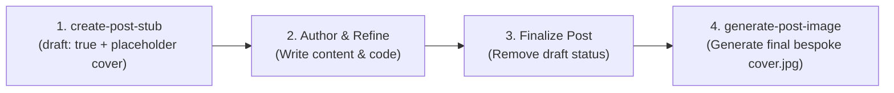

# Create Post Stub

This skill scaffolds a new blog post draft on [bwrob.dev](https://bwrob.dev) with proper
naming conventions, draft status, structured outline, and a 900×600 placeholder cover
image.

---

## Post Lifecycle Overview



> [!IMPORTANT]
> **Do not generate custom cover art during stub creation.** The stub uses the bundled
> placeholder cover image. Custom AI image generation must be deferred until the post
> content is complete and the post is undrafted.

---

## Blog Conventions & Taxonomy

### Folder & File Rules

- **Directory Pattern**: `posts/<YY-MM-DD>-<slug>/` (two-digit year, month, day prefix).
- **Slug**: Lowercase alphanumeric with hyphens (e.g. `fast-ipc-pyarrow`).
- **Co-located Cover**: `posts/<YY-MM-DD>-<slug>/cover.jpg` (must **always** live
  directly inside the post folder).
- **Post Entrypoint**: `posts/<YY-MM-DD>-<slug>/index.qmd`.

### Canonical Categories

Select one or more appropriate categories from the blog's standard taxonomy:

| Category                    | Typical Topics                                                                             |
| :-------------------------- | :----------------------------------------------------------------------------------------- |
| **`Dev Env`**               | Terminal multiplexers (tmux), shell configuration, Linux/macOS workflows, editor setups.   |
| **`Python Recipes`**        | Idiomatic Python patterns, standard library utilities, modern typing, clean code snippets. |
| **`Data Science`**          | Polars, PyArrow, Marimo dashboards, Pandas workflows, data pipelines.                      |
| **`Performance`**           | Profiling (Memray), memory optimization, Out-of-Memory debugging, native extensions.       |
| **`Financial Markets`**     | Quantitative finance, merger arbitrage, market structure, risk modeling.                   |
| **`Pythonic Distractions`** | Recreational math, algorithmic puzzles, creative coding.                                   |
| **`Career`**                | Engineering reflections, developer growth, industry observations.                          |

---

## Standardized Workflow

### Primary Method: Automated Scaffolding Script

Run the bundled scaffolding script to generate the folder, placeholder image, and
initialized `index.qmd` in a single command:

```bash
uv run python .agents/skills/create-post-stub/scripts/scaffold.py \
  --slug "<slug>" \
  --title "<Post Title>" \
  --category "<Category>" \
  --description "<1-2 sentence description>"
```

**Common Options**:

- Multi-category: Pass `--category` multiple times (e.g.
  `--category "Dev Env" --category "Python Recipes"`).
- Custom Date: Override default today's date with `--date "YYYY-MM-DD"`.
- Custom Opening Hook: Pass `--hook "Opening introductory sentence..."`.

---

### Fallback Method: Manual Step-by-Step

If running the script is not viable, follow these manual steps:

#### 1. Compute Date & Folder Prefix

```bash
POST_DATE=$(date +%Y-%m-%d)
FOLDER_PREFIX=$(date +%y-%m-%d)
POST_DIR="posts/${FOLDER_PREFIX}-${SLUG}"
mkdir -p "$POST_DIR"
```

#### 2. Copy Placeholder Cover Image

```bash
cp .agents/skills/create-post-stub/resources/placeholder-cover.jpg "$POST_DIR/cover.jpg"
```

#### 3. Render `index.qmd` from Template

Copy and substitute variables from
`.agents/skills/create-post-stub/resources/post-template.qmd`:

```yaml
---
title: "Your Post Title"
description: "A short, engaging description of the post topic."
date: "YYYY-MM-DD"
date-modified: "YYYY-MM-DD"
draft: true
categories: [Dev Env]
image: cover.jpg
format-links: [html]
toc-depth: 2
---

{width="98%" fig-align="center"}

Opening hook paragraph introducing the problem, tool, or pattern. Explain why this
matters to developers and what the post demonstrates.

## Overview & Motivation

Provide background context. Why does this challenge arise? What alternatives exist?
Outline the architecture, tool, or design choice being explored.

## Implementation & Walkthrough

Step-by-step technical breakdown. Include concrete commands, configuration snippets,
or Python code:

```python
def main() -> None:
    """Demonstrate the core pattern."""
    pass
```

Explain the code mechanics, key arguments, and non-obvious nuances.

## Key Takeaways

- Core summary point 1.
- Core summary point 2.
- Relevant documentation or GitHub links.

```text

---

## Verification

After scaffolding, verify the stub:

1. **Verify Placeholder Cover**:
   ```bash
   file posts/<YY-MM-DD>-<slug>/cover.jpg
   ```

   Confirm it exists and is a 900×600 JPEG.

2. **Verify Frontmatter**: Check `posts/<YY-MM-DD>-<slug>/index.qmd` to ensure
   `draft: true`, `image: cover.jpg`, and the captionless
   `{width="98%" fig-align="center"}` embed are present.

---

## Finalization Handoff (When Ready to Publish)

Once the post content is fully authored and ready to publish:

1. **Undraft the post**: Remove `draft: true` (or set `draft: false`) in `index.qmd`.
2. **Update modified date**: Set `date-modified: "YYYY-MM-DD"` to the current date.
3. **Generate Final Cover**: Invoke the **`generate-post-image`** skill to replace the
   placeholder `cover.jpg` with bespoke cover artwork.
