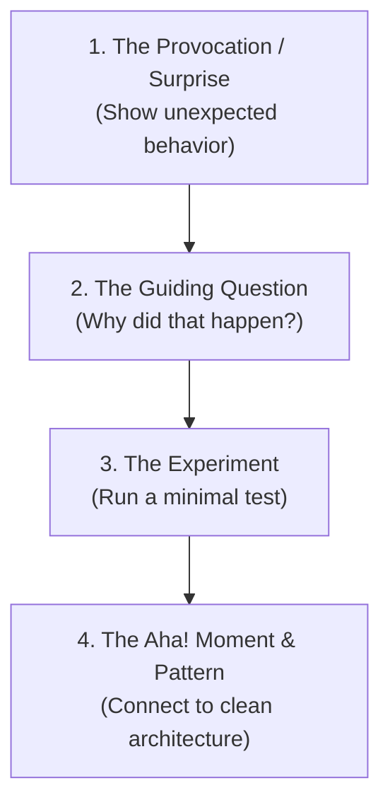

# Editorial Review

This skill guides the editorial audit of blog posts on [bwrob.dev](https://bwrob.dev).
It ensures posts maintain the blog's distinctive voice: conversational, practical,
sharp, authentic, and pedagogically sound.

## 1. Tone & Voice Principles

- **Conversational, Not a Textbook**: Write like a senior engineer sharing war stories
  and practical tips with a teammate over coffee. Kill academic stuffiness, dry lecture
  tones, and corporate fluff.
  - ❌ *Avoid*: *"In this section, we will systematically examine the theoretical
    foundations of shared memory inter-process communication."*
  - ✅ *Prefer*: *"Copying large DataFrames across process boundaries is painfully slow.
    Let's see how PyArrow lets us read the exact same memory without moving a single
    byte."*
- **Engaging & Grounded**: Use vivid engineering metaphors and real-world scenarios.
  Show empathy for developer frustration (OOMs, slow tests, confusing APIs, cryptic
  errors).
- **Concise & Punchy**: Keep paragraphs short (2–4 sentences). Use bullet points and
  code callouts to keep reading momentum brisk.

## 2. Eradicating AI Speech & Generated Text Idiosyncrasies

AI-generated prose has unmistakable stylistic tics, filler habits, and superficial
structures. The editorial review must actively hunt down and flag these patterns:

### A. Banned Vocabulary & Filler Words

Flag and replace dead giveaways of generated text:

- **Overused AI buzzwords**: *delve*, *tapestry*, *testament*, *pivotal*, *beacon*,
  *foster*, *harness*, *leverage*, *plethora*, *demystify*, *unleash*, *realm*,
  *powerhouse*, *game-changer*, *robust*, *seamless*.
- **Cliche transitions**: *"Without further ado"*, *"Let's dive in"*, *"Look no
  further"*, *"It's worth noting that"*, *"At the end of the day"*.
- **Domain Nuance (Financial Markets)**: In quantitative finance posts, distinguish
  between financial borrowing or balance-sheet leverage (valid domain terminology)
  versus lazy AI filler (*"we can leverage this library"* $\rightarrow$ flag).

### B. Structural AI Tropes

- **The Rule-of-Three Adjective List**: AI loves trios of adjectives (*"fast,
  scalable, and robust"*, *"clean, intuitive, and maintainable"*). Cut down to one
  precise word or state concrete facts instead.
- **Throat-Clearing Intros**: Opening sentences that zoom out to the universe:
  - ❌ *"In today's fast-paced digital world, managing data efficiently is crucial."*
  - ✅ *"Our nightly Polars job started dying with an OOM last Tuesday."*
- **The Symmetrical Paragraph Sandwich**: Every section ending with a hollow summary
  sentence: *"By applying this pattern, developers can ensure their applications remain
  scalable and efficient."* Delete these tidy summary sentences entirely.
- **The Inverted Code Dump**: Do not dump a 100-line utility script at the top of an
  article followed by an autopsy. Frame the architectural dilemma first, inspect the
  runtime mechanics (e.g. `typing.get_origin` or pointer arithmetic), and only then
  present the cohesive solution.
- **Preachy / Moralizing Conclusions**: Sententious wrap-ups (*"Remember, the journey
  of optimization is ongoing"*, *"Ultimately, the best tool depends on your team's
  unique needs"*). Replace with tangible next steps, GitHub links, or benchmarks.
- **Empty Meta-Commentary**: Narrating the writing process instead of delivering
  insights: *"Now that we have explored the basics, let us turn our attention to..."*
  Jump straight into the next header or code block.
- **Uncritical Superlatives**: AI writes like a PR press release. Real engineers
  discuss warts, trade-offs, awkward APIs, and breaking changes. If a tool has a steep
  learning curve or poor Windows support, say so directly.

## 3. The Socratic Method for Teaching Posts

When explaining complex systems, optimization techniques, or new libraries, **do not
simply dump the solution**. Guide the reader through inquiry and active discovery:

### The 4-Step Socratic Flow



1. **The Provocation / Surprise**: Start with a tangible puzzle or failure mode.
   *"You just ran a simple vectorized operation on a 10 GB array, and macOS instantly
   killed your process with SIGKILL. Why?"*
2. **The Guiding Question**: Prompt the reader to think about the underlying mechanics
   before revealing the answer.
   *"Did we actually allocate 20 GB of RAM, or did Python secretly duplicate memory
   during the slice?"*
3. **The Experiment / Inspection**: Walk through a minimal, reproducible code snippet
   that reveals what is happening under the hood.
   *"Let's inspect the buffer pointers with `id()` and memory addresses before and
   after..."*
4. **The Aha! Moment & Takeaway**: Formulate the insight as a clean, actionable
   principle.
   *"Now the mystery is solved: slicing created a view, but the arithmetic forced a
   full copy. Here is how we avoid it."*

## 4. Editorial Review Checklist

When reviewing a draft (e.g. `posts/<post-slug>/index.qmd`), evaluate these key
dimensions:

### A. Tone & Engagement

- [ ] Is the opening hook authentic and engaging within the first two sentences?
- [ ] Does the writing sound like a natural conversation with an experienced colleague?
- [ ] Are passive-voice constructions replaced with active, direct language?

### B. AI Speech & Idiosyncrasy Audit

- [ ] Are all banned AI vocabulary words (*delve, tapestry, leverage, seamless, etc.*)
      removed?
- [ ] Are "rule-of-three" adjective lists broken up or removed?
- [ ] Are throat-clearing intro sentences and hollow closing summary sandwiches
      eliminated?
- [ ] Does the article honestly address technical trade-offs, quirks, or edge cases?

### C. Pedagogical Structure (For Teaching / Technical Deep-Dives)

- [ ] Does the post build intuition before introducing syntax?
- [ ] Does it ask guiding questions to engage the reader's critical thinking?
- [ ] Are code examples runnable and minimal, accompanied by callout annotations
      (`<1>`, `<2>`)?

### D. Formatting, Code & Frontmatter Standards

- [ ] Category belongs to the canonical list (`Dev Env`, `Python Recipes`,
      `Data Science`, `Performance`, `Financial Markets`, `Pythonic Distractions`,
      `Career`).
- [ ] Post title is crisp and descriptive.
- [ ] Cover image embed is captionless:
      `{width="98%" fig-align="center"}`.
- [ ] Links have descriptive text (no bare `[here]` or `[link]`, complying with MD059).
- [ ] In bash/shell blocks, `# <1>` annotations never trail a line-continuation `\`.
- [ ] If bilingual (`index-pl.qmd` exists), verify matching frontmatter,
      `.lang-switcher` pills, and synchronized technical content.
- [ ] Document lines respect the 88-column limit (run `uv run rumdl fmt <file>`).

## 5. Subagent Delegation

To conduct an isolated audit without modifying the post draft directly, invoke the
**`editorial-reviewer`** subagent:

```python
# Task given to editorial-reviewer subagent:
"""
Review 'posts/<post-slug>/index.qmd'. Evaluate:
1. Tone & AI Speech: Flag any AI clichés, throat-clearing intros, or canned summary
   sandwiches. Rewrite them conversationally.
2. Pedagogy: For teaching posts, does it follow the Socratic flow of guided inquiry?
3. Clarity: Are code snippets minimal, annotated, and runnable?
Return actionable feedback and line-by-line rewrite suggestions.
"""
```
