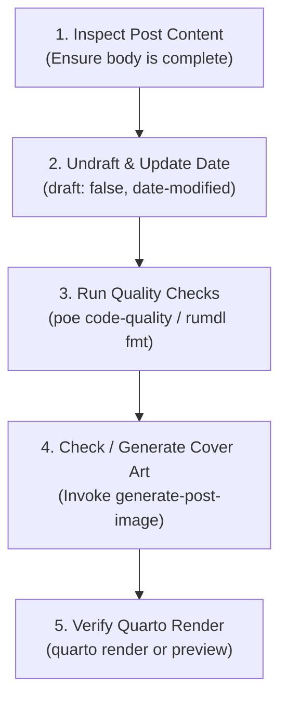

# Finalize Post

This skill orchestrates the end-of-lifecycle process for publishing a blog post on
[bwrob.dev](https://bwrob.dev), transitioning a draft into a polished, production-ready
article.

## Finalization Checklist



## Workflow Steps

Execute the following steps in sequence when preparing a draft for publication:

### 1. Inspect Post Content

Read `posts/<post-slug>/index.qmd`:

- Ensure all placeholder tokens (`{{...}}`) have been replaced with real content.
- Confirm the article follows the blog's structure: Hook $\rightarrow$ Motivation
  $\rightarrow$ Walkthrough $\rightarrow$ Key Takeaways.
- Verify code blocks have proper language identifiers (e.g. ````Python`) and run
  cleanly.

### 2. Undraft and Update Timestamp

In `posts/<post-slug>/index.qmd` frontmatter (and `index-pl.qmd` if bilingual):

1. Remove `draft: true` (or change to `draft: false`).
2. Update `date-modified` to today's date:

   ```yaml
   date-modified: "YYYY-MM-DD"
   ```

### 3. Run Quality & Formatting Checks

Execute the repository quality suite to format Markdown (`rumdl`), format/lint Python
(`ruff`), and verify types (`pyrefly`):

```bash
uv run poe code-quality
```

If specific Markdown files need targeted reformatting to the 88-column limit:

```bash
uv run rumdl fmt "posts/<post-slug>/index.qmd"
# If bilingual:
uv run rumdl fmt "posts/<post-slug>/index-pl.qmd"
```

### 4. Replace Placeholder Cover Art

Check if `posts/<post-slug>/cover.jpg` is still the placeholder or if bespoke art is
needed:

- If the cover is still the placeholder (or needs an update), invoke the
  **`generate-post-image`** skill.
- Follow the visual art direction in `references/style-guide.md` to produce an optimized
  900×600 JPEG at `posts/<post-slug>/cover.jpg`.

### 5. Verify Quarto Rendering

Test rendering the post locally to confirm there are no Quarto syntax errors or broken
references:

```bash
quarto render "posts/<post-slug>/index.qmd"
```

Or view the rendered post in the browser via the background preview task:

```bash
uv run poe preview
```

Visit `http://localhost:3333/` to inspect layout, figure alignment, and code block
formatting.

## Publication Handoff

When all verification steps succeed, the post can be committed to git using the
repository's conventional commit format:

```bash
git add posts/<post-slug>/
git commit -m "feat(posts): publish <post-slug>"
# Optional direct publishing to gh-pages via Poe:
# uv run poe publish
```
