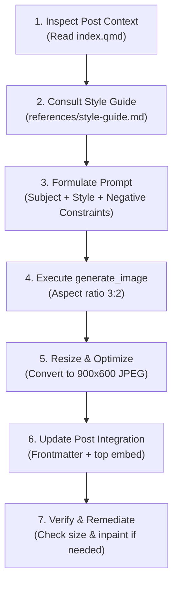

# Post Image Generator

This skill defines the technical and procedural workflow for generating, optimizing,
and embedding blog post cover images (`cover.jpg`) on [bwrob.dev](https://bwrob.dev).

For all visual aesthetics, art direction, color schemes, and motif guidelines, consult
the **[Style Guide](./references/style-guide.md)**.

---

## Technical Specifications & Rules

- **Destination File Path**: Must **always** be placed directly inside the post folder:
  `posts/<post-slug>/cover.jpg`. Never place covers in `assets/` or other shared
  directories.
- **Dimensions & Format**: **900 × 600** pixels (3:2 horizontal aspect ratio), JPEG
  format optimized at quality ~85 (target file size: 40–85 KB).
- **Frontmatter Configuration**: `posts/<post-slug>/index.qmd` must declare:

  ```yaml
  image: cover.jpg
  ```

- **In-Post Display Embed**: The cover must be embedded at the top of the post body
  (immediately following frontmatter) at 98% width:

  ```markdown
  {width="98%" fig-align="center"}
  ```

> [!NOTE]
> **Lifecycle Timing**: Invoke this skill at the final stage of post authoring—after
> post content is complete, finalized, and undrafted. This replaces the initial
> placeholder `cover.jpg` created by `create-post-stub`.

---

## Procedural Workflow



### 1. Inspect Post Context

Read `posts/<post-slug>/index.qmd`:

- Note the title, description, categories, and core technical theme.
- Identify the central technology, library, framework, or architectural pattern
  discussed.

### 2. Consult the Visual Style Guide

Review **[Style Guide](./references/style-guide.md)** for art direction:

- Choose the composition type (modular system, terminal pane, node graph, geometric
  field, etc.).
- Check technology motif recommendations (e.g. Polars low-poly bear, Marimo moss sphere,
  Python ribbons).
- Select the background and accent color palette.
- Note required negative constraints.

### 3. Construct the Prompt

Assemble the prompt components:

1. **Technical Subject**: Clear description of the subject or system architecture.
2. **Visual Style**: Aesthetic descriptors from the Style Guide (e.g. matte finish,
   hairline borders, soft ambient depth).
3. **Color Palette**: Background base (`#222738` to `#262b3d`) and accent colors.
4. **Negative Constraints**: Standard wordless and clean-render constraints
   (`wordless, no text, no words, no title, no letters, no neon bloom, no cartoon characters`).

*(See [Style Guide](./references/style-guide.md) for full example prompt formulations).*

### 4. Execute Image Generation

Call the `generate_image` tool:

- `Prompt`: Your formulated prompt.
- `ImageName`: Descriptive snake_case identifier (e.g. `polars_lazy_execution_cover`).
- `AspectRatio`: `"3:2"` (matches site standard landscape ratio).

### 5. Resize and Optimize Image

Generated images are written to the conversation artifact directory as `.png` or `.jpg`.
Resize and convert the generated image to an optimized 900×600 JPEG at
`posts/<post-slug>/cover.jpg`.

**Using macOS `sips`**:

```bash
sips -s format jpeg -z 600 900 -s formatOptions 85 "<artifact_image_path>" --out "posts/<post-slug>/cover.jpg"
```

**Using Python (Pillow)**:

```bash
uv run python -c "
from PIL import Image
im = Image.open('<artifact_image_path>')
im = im.resize((900, 600), Image.Resampling.LANCZOS)
im.convert('RGB').save('posts/<post-slug>/cover.jpg', 'JPEG', quality=85, optimize=True)
"
```

### 6. Update Post Frontmatter & Embed

Verify that `posts/<post-slug>/index.qmd` includes the cover in the frontmatter and
embeds it at the top of the body:

```yaml
---
title: "Your Post Title"
description: "Your Post Description"
categories: [...]
image: cover.jpg
---

{width="98%" fig-align="center"}
```

### 7. Verify & Remediate

1. **Verify Technical File Properties**:
   Ensure the output is 900×600 and lightweight (~40–85 KB):

   ```bash
   file posts/<post-slug>/cover.jpg
   ls -lh posts/<post-slug>/cover.jpg
   ```

2. **Inspect Visual Output**:
   Check that the image rendered cleanly and is completely wordless/text-free.

3. **Remediate Accidental Text (Inpainting)**: If the generation contains faint unwanted
   text or artifact labels, inpaint them cleanly using OpenCV Telea:

   ```bash
   uv run --with opencv-python python -c "
   import cv2, numpy as np
   img = cv2.imread('posts/<post-slug>/cover.jpg')
   mask = np.zeros(img.shape[:2], dtype=np.uint8)
   mask[y1:y2, x1:x2] = 255
   cv2.imwrite('posts/<post-slug>/cover.jpg', cv2.inpaint(img, mask, 3, cv2.INPAINT_TELEA))
   "
   ```

> [!NOTE]
> **Quarto Live Preview**: If a Quarto preview server (`quarto preview`) is running in
> the background, manual re-rendering is unnecessary as it hot-reloads the updated cover
> image.
