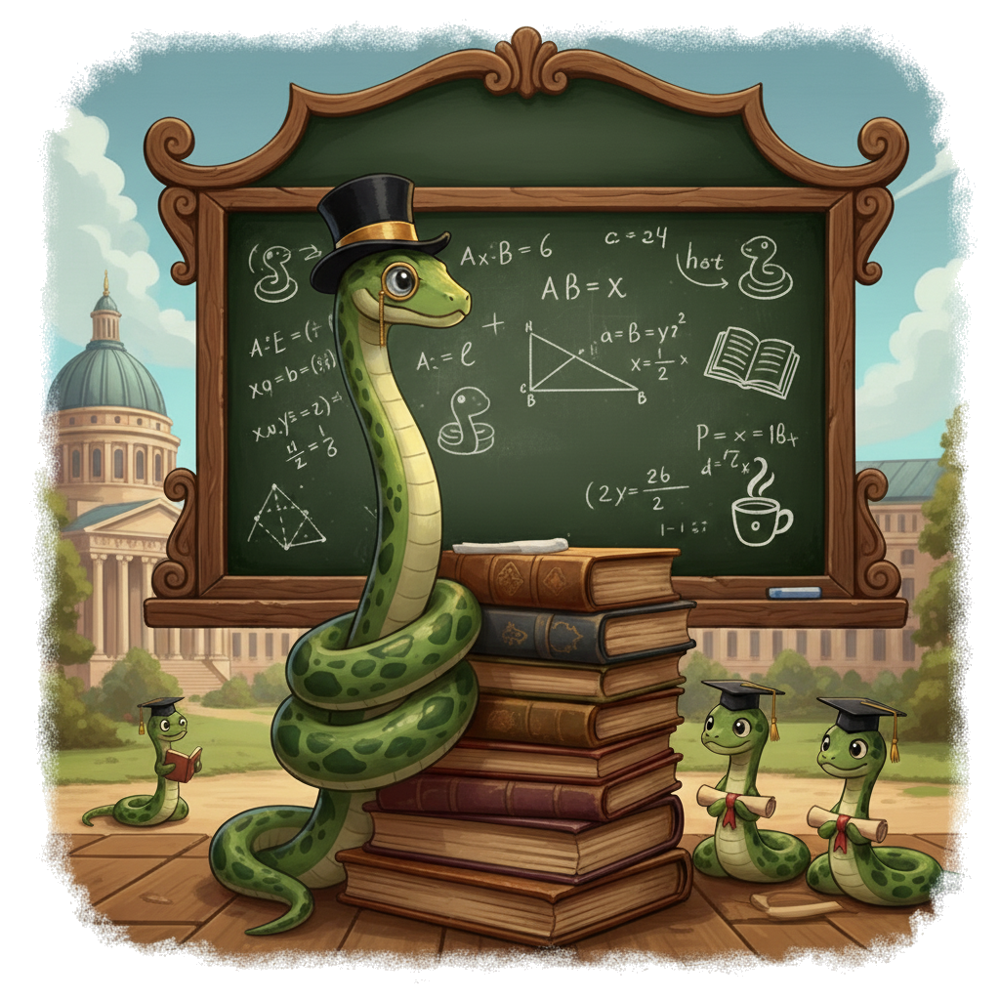

::: {.course-info-card}
::: {.course-info-grid}
::: {.course-info-item}
::: {.label}
Institution
:::
::: {.value}
Client internal training
:::
:::

::: {.course-info-item}
::: {.label}
Semester
:::
::: {.value}
Autumn/Winter 2025
:::
:::

::: {.course-info-item}
::: {.label}
Lecturer
:::
::: {.value}
Bartosz Wróblewski
:::
:::
:::
:::

:::: {.columns}

::: {.column width="25%"}
{.course-logo}
:::

::: {.column width="70%"}
A comprehensive Python training program designed for intermediate Python users, targeting quantitative analysts and data scientists. Covering core language mechanics needed to graduate from "Python user" to "Python developer", with a focus on writing clean, efficient, and maintainable code in a professional environment.
:::

::::

## Course Modules

1. [Fibonacci Numbers Case Study](25-10-12-python-academy-fibonacci/) - Introduction to optimization, recursion, and memoization.
2. [Functions, Closures and Decorators](25-10-23-python-academy-functions-closures-decorators/) - Deep dive into Python's first-class functions and scope.
3. [Efficient Iteration](25-11-05-python-academy-iteration/) - Understanding iterators, generators, and memory-efficient loops.

::: {.callout-tip collapse="true"}
## Interlude: Tooling & Workflow
* [Python Env Management: From venv to uv](25-11-27-python-academy-environment-management/) - Best practices for dependency isolation and modern tooling.
:::

4. [Anatomy of a Python Class](25-12-04-python-academy-class-anatomy/) - Internal mechanics of objects, attributes, and methods.
5. [The Python Data Model](25-12-12-python-academy-data-model/) - Mastering dunder methods and Python's protocol-based design.
6. [Inheritance, Polymorphism & Protocols](25-12-18-python-academy-oop-basics/) - Clean object-oriented design and structural subtyping.
