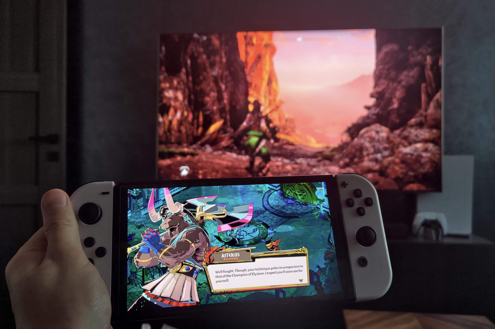
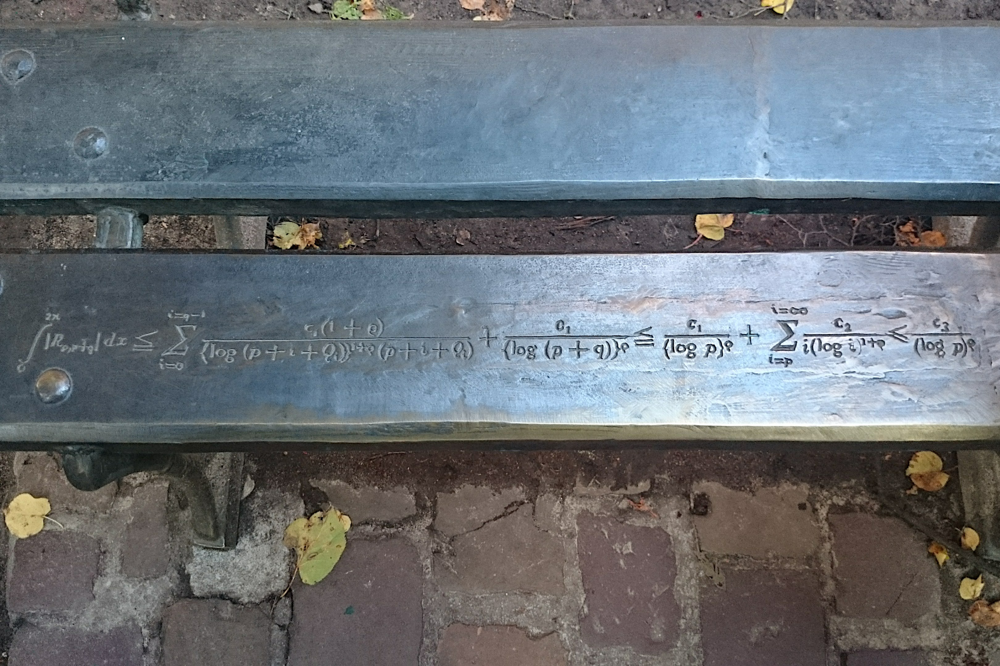
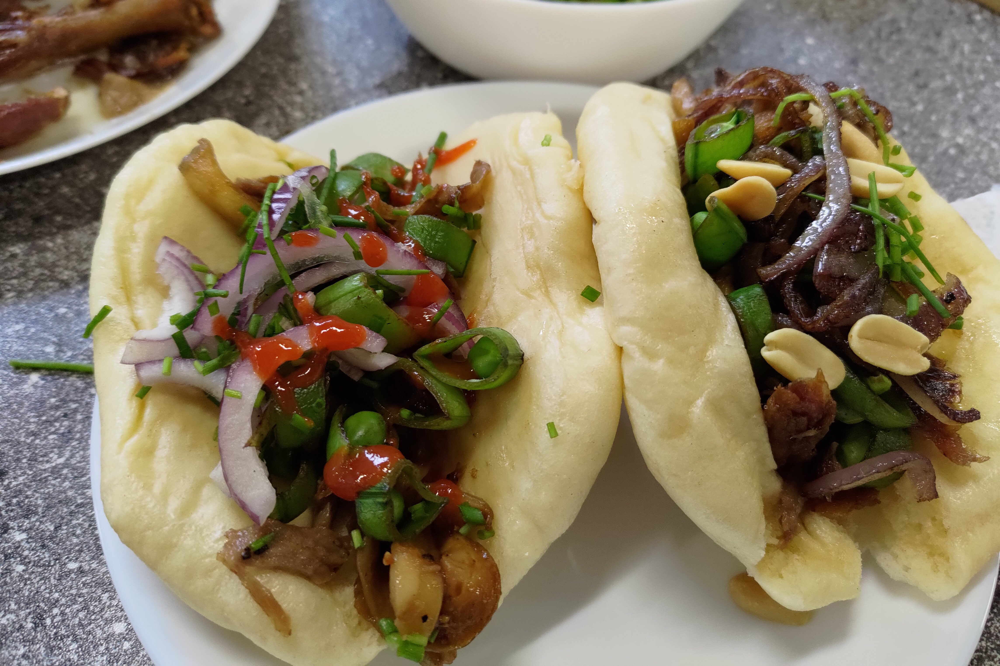
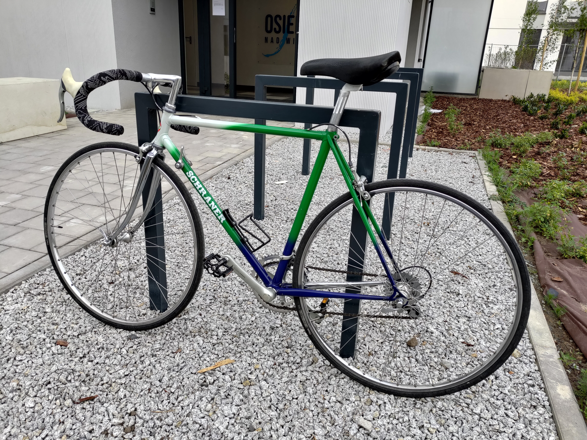
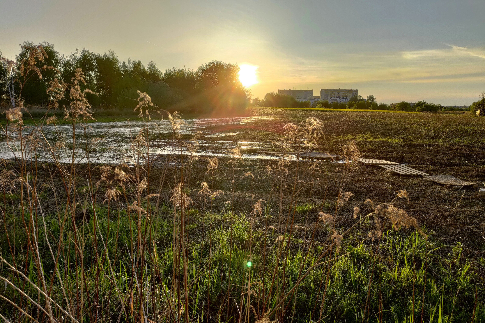

::: {.page-header-block}

# Fueling the Mind & Body

A glimpse into my interests outside technology and finance—the activities that keep me balanced, motivated, and perpetually curious.
:::

::: {.hobby-section}

::: {.hobby-card}

::: {.hobby-content}

### Gaming

I enjoy deep, single-player experiences, with a particular fondness for roguelikes and expansive open worlds. Gaming is my primary way to unwind and explore interactive storytelling.

**Favorites:** [God of War (2018)](https://www.metacritic.com/game/god-of-war/), [Hades](https://www.metacritic.com/game/hades/), [Trackmania](https://www.metacritic.com/game/trackmania/).
**Recommendation:** [It Takes Two](https://www.metacritic.com/game/it-takes-two/) for cooperative play.
:::
:::

::: {.hobby-card}

::: {.hobby-content}

### Photography

Capturing the world through the lens of a Sony A6000. I find beauty in the contrast of urban settings and the serenity of nature, always looking for interesting compositions and the play of light.
:::
:::

::: {.hobby-card}

::: {.hobby-content}

### History of Science & Mathematics

Intrigued by the "tectonic creep" of progress. I enjoy exploring how revolutionary ideas were built upon the incremental small wins of those who came before.
:::
:::

::: {.hobby-card}

::: {.hobby-content}

### Cooking

A creative outlet focused on Asian fusion. I love the challenge of making something delicious from leftovers and experimenting with bold, cross-cultural flavors like kimchi with local staples.
:::
:::

::: {.hobby-card}

::: {.hobby-content}

### Road Cycling

A proud owner of a refurbished 90s vintage road bike. It’s a perfect blend of mechanical simplicity and the freedom of the open road.
:::
:::

::: {.hobby-card}

::: {.hobby-content}

### Strolling

Awareness meditation in motion. Walking through my neighborhood without distractions allows me to observe the subtle changes in the world around me and clear my mind.
:::
:::

:::
