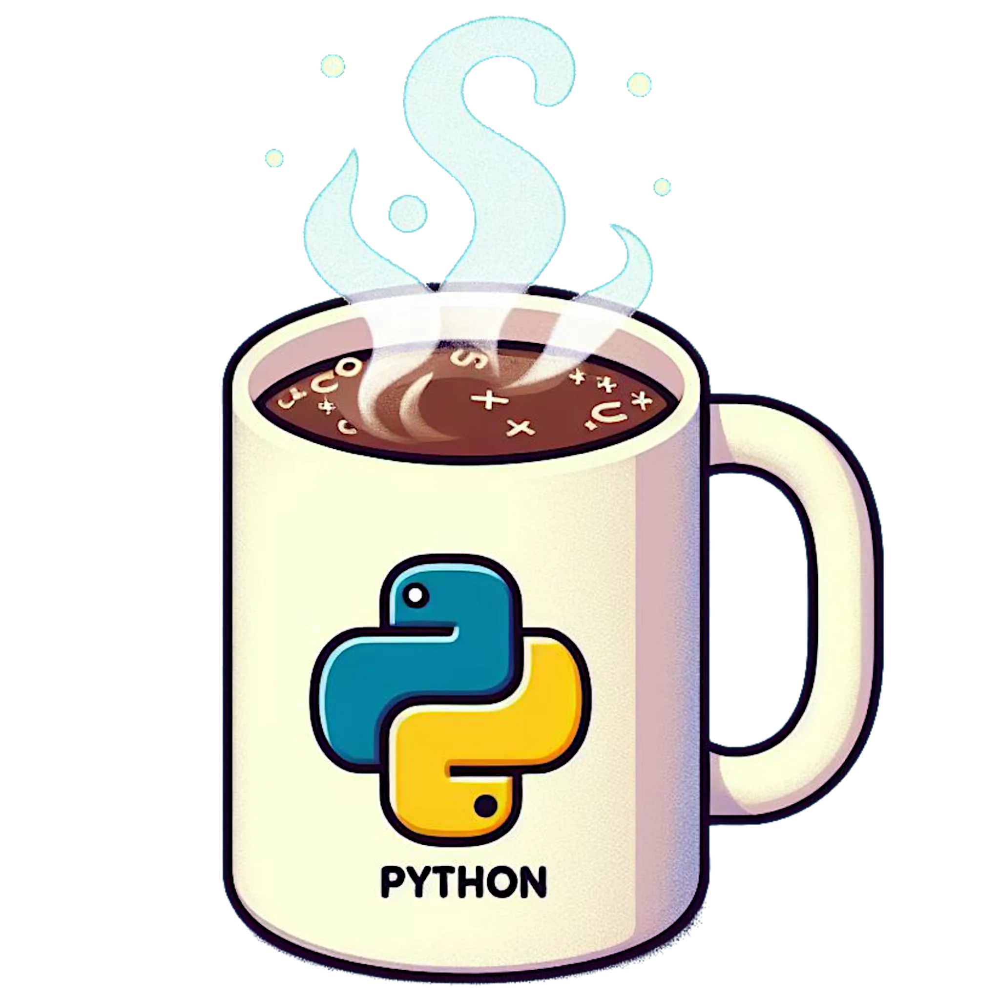

---
webpage:
  title: "bwrob blog"
  site-url: "https://bwrob.github.io"
  description: "bwrob personal and professional blog"

  favicon: assets/logo/python_mug.png
  twitter-card:
    title: "bwrob blog"
    description: "bwrob personal and professional blog"
    image: assets/logo/python_mug.png
    card-style: summary_large_image

  open-graph:
    title: "bwrob blog"
    description: "bwrob personal and professional blog"
    image: assets/logo/python_mug.png
    site-name: "bwrob blog"

  image: assets/logo/python_mug.png

listing:
  contents: posts

  sort: "date desc"
  type: grid
  sort-ui: true
  filter-ui: true

  categories: true
  feed: true

page-layout: article
title-block-banner: false
---

:::: {layout="[ 20, 80]"}

::: {#first-column}
{fig-align="center"}
:::

::: {#second-column}
This blog is a reflection of my journey from mathematician to quantitative analyst to software engineer.
Here, I document what I've learned, focusing on the tools and concepts that define my daily work.

While technical rigor is the goal, I try not to take myself too seriously.
So, grab a cup of coffee and join me — whether you're looking for a specific solution or just exploring.
:::

::::
