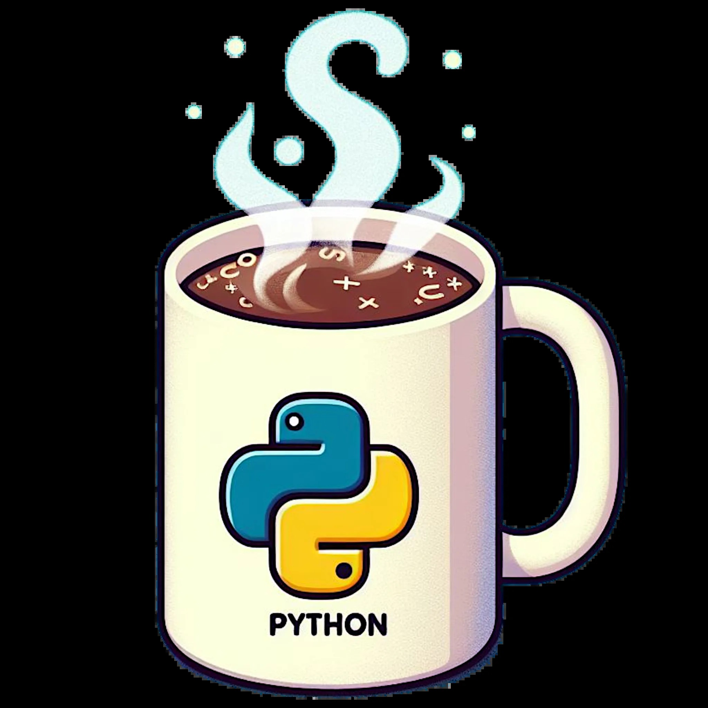

{width="98%" fig-align="center"}

This is the first post in the bwrob blog. Welcome!

This blog is a battleground of sorts, but instead of swords and shields, we wield the
weapons of Python and C++. I'm a mathematician turned quantitative analyst turned
software engineer. You can expect high standard deviation of topics here.

Here, I'll document my coding conquests, from building practical and impractical tools,
exploring financial concepts, to playing around with physics simulations.

Expect a healthy dose of humor alongside the technical discussions. Let's be honest,
even the most complex problems are more enjoyable with a sprinkle of laughter. So, grab
a cup of coffee and join me on this exploration – even if it's just for one interested
reader!
