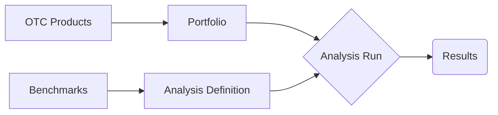
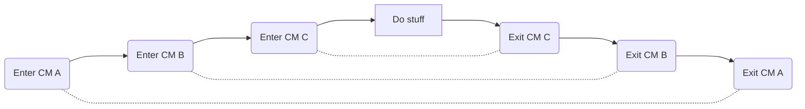

{width="98%" fig-align="center"}

## Working with Risk Management Systems

As a quantitative finance professional you'll often find yourself working with risk
management systems (RMS). RMS's are extensive frameworks that let you define a book
(portfolio) of financial transactions and run a variety of pricing and risk calculations
on it. For big financial players, like investment banks, the RMS is an internal
proprietary codebase run in-house. For smaller enterprises or second-line reporting,
building such vast infrastructure from scratch is not feasible. This leads us to vendor
RMS platforms (e.g., Murex, Acadia).

Working with vendor RMS platforms entails juggling multiple stateful resources: defining
OTC products, benchmarks, portfolios, and running simulations across dozens of API
endpoints. When these calls fail mid-sequence, resources on the remote server risk being
orphaned, leaking memory and exhausting licensing seats.

Thankfully, Python provides context managers (`with` statements) to manage resource
lifecycles reliably. Standard library's `contextlib` module offers `ExitStack`, a
powerful tool designed specifically for dynamic, multi-resource contexts. Today we will
explore `ExitStack` in a realistic quantitative RMS workflow.

## Setting the Stage

To run an analysis, the RMS first needs to know what our positions are. In case of
tradable assets it's simple --- we provide a market identifier and how much of the
instrument we are holding. What do we do if we have some bespoke agreement with specific
counterparty (an over-the-counter transaction)? We will need to define it from scratch
in the RMS using data from the term sheet (assuming this kind of agreement is covered).

Next, we need to specify the risk metrics we want to calculate --- define the analysis
scope. Let's say we hold some equity options and we are intertested in their deltas and
beta exposures. The betas are defined with respect to some benchmark --- ex. portfolio
holding 1 stock in US500 ETF. So we define the benchmark and link it to our analysis.

Finally --- once portfolio and analysis are defined in RMS --- we call the API to start
the calculation and respond with results. This is the control flow we execute to get to
this point:



If we know we're never going to use all of the resources, we should clean up the server
artifacts after receving the results. So for each resource we should have a CM.

### Mock Functions

The setup described above comes from a real-life situation I worked through. I can't
show you the actual API usage or data (or even the name of RMS itself), so we need to
define some mocker functions. Mocks like this are actually not an uncommon thing ---
such approach is prevalent in testing API client code. In our case it would look like
this:

```{python}
from enum import StrEnum
from uuid import uuid4


class MockObject(StrEnum):
    """Types of mock objects."""

    ANALYSIS = "analysis"
    BENCHMARK = "benchmark"
    OTC_PRODUCTS = "otc_products"
    PORTFOLIO = "portfolio"


def mock_object(object_type: MockObject) -> str:
    """Mock a UUID for a given object type.

    Args:
        object_type: Type of object.
    """
    return f"{object_type}_{uuid4()}"


def mock_preparation(object_type: MockObject, **kwargs) -> None:
    """Mock preparation of an object.

    Args:
        object_type: Type of object.
    """
    details = f" using {kwargs}" if kwargs else "."
    print(f"Preparing {object_type}{details}")  # <1>


def mock_clean_up(object_uuid: str) -> None:
    """Mock clean up of an object.

    Args:
        object_uuid: Uuid of the object.
    """
    print(f"Cleaning up after {object_uuid}.")  # <1>
```

1. Mocking the preparation process for logging purposes.

For each of the four types of resources we mock the preparation, object (ex. API
response, some id of definition on server) and the clean up process.

### Context Managers

Easiest way to define a CM is through `contextlib.contextmanager` decorator. To use it,
you need a function that returns a generator. Code executed on enter should come before
`yield` statement and the one for the exit afterwards. The generator yields the result
of the CM (ex. handle to an opened file), the `y` in `with x(*args) as y:`.

```{python}
from contextlib import contextmanager
from typing import Generator


@contextmanager
def analysis(
    *,
    benchmark_uuid: str,
) -> Generator[str, None, None]:
    """Mock definition of an analysis.

    Example: equity delta and correlation with benchmark.

    Args:
        benchmark_uuid: Uuid of the benchmark.
    """
    mock_preparation(
        MockObject.ANALYSIS,
        benchmark_name=benchmark_uuid,
    )
    analysis_uuid = mock_object(MockObject.ANALYSIS)
    yield analysis_uuid
    mock_clean_up(analysis_uuid)  # <1>
```

1. Clean up after the analysis is complete.

Modern approach to Python development leans heavily towards type annotations. Dynamical
typing is powerful but can lead to unwieldy code. To properly annotate the `analysis`
function we need to import `Generator` from `typing` module. Remember, the
`@contextmanager` decorator takes the function and turns it into CM --- a class with
`__enter__` and `__exit__` methods. The `Generator` needs three inputs but in our case
only the first one is important --- `YieldType`, here `str`
([see](https://docs.python.org/3/library/typing.html#typing.Generator) for more).

With this done implementing the 3 remaining CMs is easy, just remember our flow chart.

```{python}
@contextmanager
def benchmark() -> Generator[str, None, None]:
    """Mock definition of a benchmark.

    Args:
        otc_products_uuid: Uuid of the otc products.
    """
    mock_preparation(
        MockObject.BENCHMARK,
    )
    benchmark_uuid = mock_object(MockObject.BENCHMARK)
    yield benchmark_uuid
    mock_clean_up(benchmark_uuid)  # <1>


@contextmanager
def otc_products() -> Generator[str, None, None]:
    """Mock definition of an otc products.

    Args:
        otc_products_uuid: Uuid of the otc products.
    """
    mock_preparation(MockObject.OTC_PRODUCTS)
    otcs_uuid = mock_object(MockObject.OTC_PRODUCTS)
    yield otcs_uuid
    mock_clean_up(otcs_uuid)  # <2>


@contextmanager
def portfolio(
    *,
    portfolio_name: str,
    otc_products_uuid: str,
) -> Generator[str, None, None]:
    """Mock definition of a portfolio.

    Args:
        otc_products_uuid: Uuid of the otc products.
    """
    mock_preparation(
        MockObject.PORTFOLIO,
        portfolio_name=portfolio_name,
        otc_products_uuid=otc_products_uuid,
    )
    portfolio_uuid = mock_object(MockObject.PORTFOLIO)
    yield portfolio_uuid
    mock_clean_up(portfolio_uuid)  # <3>
```

1. Clean up after the benchmark is complete.
1. Clean up after the OTC products definition is complete.
1. Clean up after the portfolio definition is complete.

### Analysis Results

No stress or complexity here, to run the analysis we need to specify which analysis to
run on which portfolio.

```{python}
import pandas as pd


def analysis_results(
    *,
    analysis_uuid: str,
    portfolio_uuid: str,
) -> pd.DataFrame:
    """Mock running the analysis.

    Args:
        analysis_uuid: Uuid of the analysis.
        portfolio_uuid: Uuid of the portfolio.
    """
    print(f"Running analysis {analysis_uuid} on portfolio {portfolio_uuid}.")
    return pd.DataFrame()
```

## Running Mock Risk Analysis

Finally, we can run some (mock) risk analysis!

### Using Contexts Directly

First, we use the managers directly through `with` clause, remembering the dependencies
from our flow chart.

```{python}
PORTFOLIO = "portfolio_1"


def print_title(title: str) -> None:
    """Print a title padded, surrounded by dashes and empty lines."""
    print("\n" + title.center(60, "-") + "\n")


# | code-fold: true
# | code-summary: "Show the code"

print_title("Running analysis using contexts directly.")

with otc_products() as otc_uuid:
    with benchmark() as benchmark_uuid:
        with portfolio(
            portfolio_name=PORTFOLIO,
            otc_products_uuid=otc_uuid,
        ) as portfolio_uuid:
            with analysis(
                benchmark_uuid=benchmark_uuid,
            ) as analysis_uuid:
                results = analysis_results(
                    analysis_uuid=analysis_uuid,
                    portfolio_uuid=portfolio_uuid,
                )
```

Great, the behaviour is as expected, everything is cleaned after nicely. We achieved the
goal but the code is unmaintainable. Looks like a subject of the joke *"good code makes
your job safe for a day, but terrible code in production makes it safe for a lifetime"*.
Being reckless and with no regard to job security as we are, we'll fix it.

*I can clearly recall the most unmanageable and unreadable code I've seen in my career
and the culprit was fired in the end. Different reasons, long time later, but still. So
the joke is just a joke, don't rely on bad code as job insurance.*

## The ExitStack

This is where `ExitStack` from `contextlib` shines: managing complex, dynamic context
lifecycles without deep nesting. Conceptually it's a First-In-Last-Out (FILO) stack.
You push context managers onto the stack dynamically; when the stack exits, it unwinds
and closes them in reverse order.



So the flow is exactly the same as in our first attempt. Let's try it!

```{python}
from contextlib import ExitStack


def run_analysis_with_exit_stack() -> None:
    """Mock running the analysis using exit stack."""
    with ExitStack() as stack:
        otc_uuid = stack.enter_context(otc_products())
        benchmark_uuid = stack.enter_context(benchmark())
        portfolio_uuid = stack.enter_context(
            portfolio(
                portfolio_name=PORTFOLIO,
                otc_products_uuid=otc_uuid,
            )
        )
        analysis_uuid = stack.enter_context(
            analysis(
                benchmark_uuid=benchmark_uuid,
            )
        )
        results = analysis_results(
            analysis_uuid=analysis_uuid,
            portfolio_uuid=portfolio_uuid,
        )
```

That's amazing (if the approach works)! In our code we end up with only single `with`
clause and the outputs of CMs are defined just like the regular variables. We just need
to wrap the CM calls in `stack.enter_context` method that pushes each CM to the stack.

```{python}
print_title("Running analysis with exit stack.")
run_analysis_with_exit_stack()

```

It works as well! We also get a package of benefits for free.

### Disabling the Clean Up

Working with APIs is tricky and debugging can be painful. If we notice something
unexpected with the results we are receiving, it could be due to an issue at any stage.
In such cases, disabling artifact cleanup and examining intermediate state is valuable.
With the `ExitStack` approach, we simply detach the contexts before the stack exits:

```{python}
def run_analysis_with_exit_stack(
    clean_up: bool = True,
) -> None:
    """Mock running the analysis using exit stack.

    Args:
        clean_up: Whether to clean up after the objects.
    """

    with ExitStack() as stack:
        otc_uuid = stack.enter_context(otc_products())
        benchmark_uuid = stack.enter_context(benchmark())
        portfolio_uuid = stack.enter_context(
            portfolio(
                portfolio_name=PORTFOLIO,
                otc_products_uuid=otc_uuid,
            )
        )
        analysis_uuid = stack.enter_context(
            analysis(
                benchmark_uuid=benchmark_uuid,
            )
        )
        results = analysis_results(
            analysis_uuid=analysis_uuid,
            portfolio_uuid=portfolio_uuid,
        )
        if not clean_up:
            _ = stack.pop_all()  # <1>
    return results
```

1. This is a Pythonic way of disregarding outputs of `some_function`. Method `pop_all`
   actually moves the stack contents to a new stack, but we don't care about that. We
   just want to get rid of them from our current one.

```{python}
print_title("Running analysis with exit stack and no clean up.")
run_analysis_with_exit_stack(clean_up=False)
```

### Multiple Portfolios

Benefit #2: what do we do if we have multiple managers and many portfolios to re-run
for? Or—outside of the example scope—we want to hold multiple files open at the same
time? Easy: we push to the stack dynamically in a loop.

```{python}
PORTFOLIOS = ["portfolio_1", "portfolio_2", "portfolio_3"]


def run_analysis_with_exit_stack(clean_up: bool = True):
    """Mock running the analysis for multiple portfolios using exit stack.

    Args:
        clean_up: Whether to clean up after the objects.
    """
    with ExitStack() as stack:
        otc_uuid = stack.enter_context(otc_products())
        benchmark_uuid = stack.enter_context(benchmark())
        portfolio_uuids = [
            stack.enter_context(
                portfolio(
                    portfolio_name=portfolio_name,
                    otc_products_uuid=otc_uuid,
                )
            )
            for portfolio_name in PORTFOLIOS
        ]
        analysis_uuid = stack.enter_context(
            analysis(
                benchmark_uuid=benchmark_uuid,
            )
        )
        result_parts = [
            analysis_results(
                analysis_uuid=analysis_uuid,
                portfolio_uuid=portfolio_uuid,
            )
            for portfolio_uuid in portfolio_uuids
        ]
        results = pd.concat(result_parts)

        if not clean_up:
            _ = stack.pop_all()
    return results


print_title("Running analysis with exit stack on multiple portfolios.")
run_analysis_with_exit_stack(clean_up=True)
```

## Conclusion

Today we've learnt a new Python tool and seen an example of how quantitative developer
might set up risk reporting job on vendor RMS. Sound like a very niche and unlikely
situation for you? Maybe. But the moral here is to go and explore the Python standard
library. Without using any additional packages we improved readability and flexibility
of our initial attempt. Python really has *'batteries included'*,
[see](https://docs.python.org/3/library/index.html) for yourself!

::: callout-note
Download the complete code from
[`dynamic_context_management_with_exitstack.py`](../../assets/python/dynamic_context_management_with_exitstack.py).
:::
