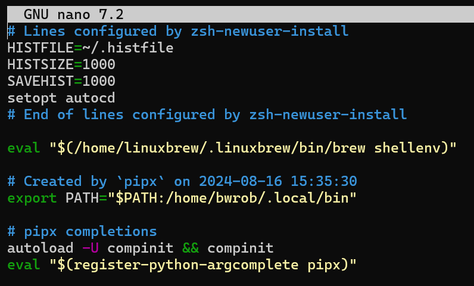
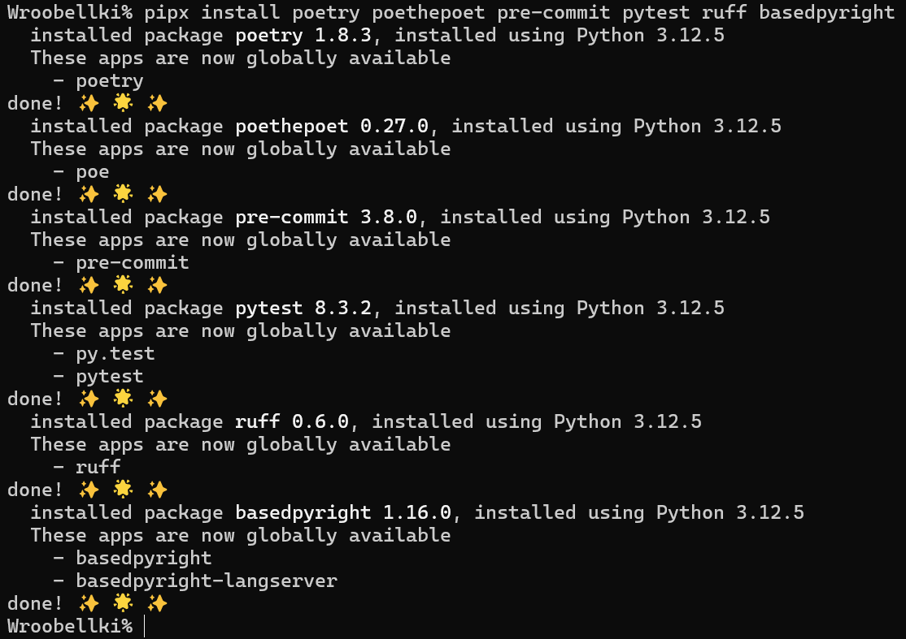
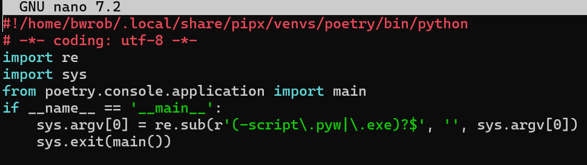
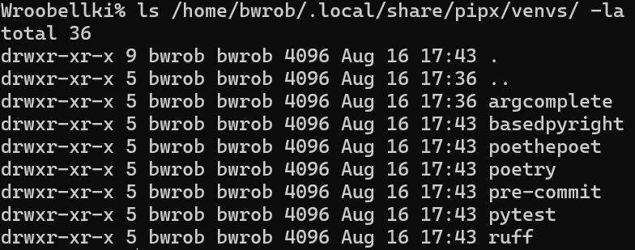

Installing Python dev tools on Linux is a bit of a pain, but it doesn't have to be. This post will show you how to set up a great Python dev environment on Linux using `brew`, `pipx`, and `poetry`.

```{bash}
brew install python@3.12 python@3.13
```

Dev tools should be accessable globally, but should't be in the defualt global python env.
Solution - `pipx`

```{bash}
brew install pipx
pipx ensurepath
pipx install argcomplete --force
```

Add pipix completions to config

```{bash}
nano  .zshrc

autoload -U compinit && compinit
eval "$(register-python-argcomplete pipx)"
```

{width="90%" fig-align="center"}

Install dev tools

```{bash}
pipx install --force ruff hapless poethepoet poetry pre-commit uv pytest basedpyright
```

{width="90%" fig-align="center"}

```{bash}
nano $(which poetry)
```

{width="90%" fig-align="center"}

Shebang Line (#!):
#!/home/bwrob/.local/share/pipx/venvs/poetry/bin/python: This line specifies the interpreter used to run the script. In this case, it's a Python interpreter located in a specific virtual environment (poetry).

This script acts as a launcher for the poetry command. It sets up the environment and handles potential script extensions before delegating the actual command execution to the poetry library.

We can see that each of the toolos install with pipx is installed in its own venv, but is available globally

```{bash}
ls /home/bwrob/.local/share/pipx/venvs/ -la
```

{width="90%" fig-align="center"}

Copy your

```{bash}
# Instal dependencies
poetry install
# Install pre-commit
pre-commit install --install-hooks --overwrite --allow-missing-config
# Update pre-commit
pre-commit autoupdate
# Run pre-commit to test setup
pre-commit run --all-files
```
