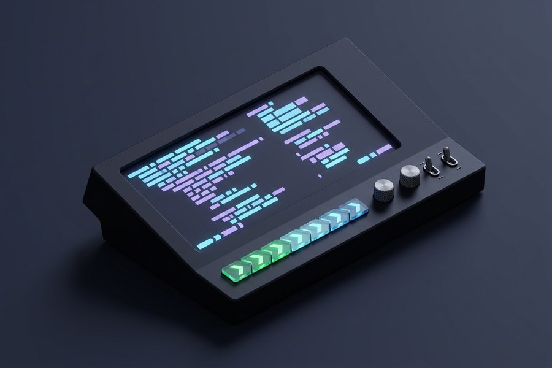

{width="98%" fig-align="center"}

## Oh My Posh

Oh My Posh is a prompt theme engine for any shell, including Zsh. It allows you to
customize your terminal prompt with themes and segments.

```bash
brew install jandedobbeleer/oh-my-posh/oh-my-posh
echo 'eval "$(oh-my-posh init zsh)"' >> ~/.zshrc
echo 'OH_MY_POSH_THEME="kali"' >> ~/.zshrc
```

## Autosuggestions

Zsh autosuggestions provide command suggestions based on your history and current input,
enhancing your command line experience.

```bash
brew install zsh-autosuggestions
# To activate the autosuggestions, add the following at the end of your ~/.zshrc:
brew_prefix=$(brew --prefix)
echo "source $brew_prefix/share/zsh-autosuggestions/zsh-autosuggestions.zsh" \
  >> ~/.zshrc
```

## Aliases

Create a file `~/.bash_aliases` and add your aliases there, or directly in `~/.zshrc`.

```bash
# Alias definitions.
# You may want to put all your additions into a separate file like
# ~/.bash_aliases, instead of adding them here directly.

if [ -f ~/.bash_aliases ]; then
    . ~/.bash_aliases
fi

alias zshconfig='nano ~/.zshrc'
alias ls='eza -la --group-directories-first --icons'
```

## Minor Packages

A collection of lightweight CLI enhancements to round out your daily terminal workflow:

### Fzf

Fuzzy finder for command line, useful for searching files, history, etc.

```{bash}
brew install fzf
# Set up fzf key bindings and fuzzy completion
echo 'source <(fzf --zsh)' >> ~/.zshrc
```

### Eza

Better alternative to `ls` with icons and better defaults.

```{bash}
brew install eza
echo 'alias ls="eza -la --group-directories-first --icons"' >> ~/.zshrc
```

### Thefuck

A tool to correct mistyped commands in the terminal.

```{bash}
brew install thefuck
echo 'eval $(thefuck --alias)' >> ~/.zshrc
```

### Tmux

A terminal multiplexer that allows you to manage multiple terminal sessions from a
single window.

```{bash}
brew install tmux
echo 'alias tmux="tmux -2"' >> ~/.zshrc
```

### Fastfetch

A tool to display system information in the terminal, similar to neofetch but faster.

```{bash}
brew install fastfetch
echo 'alias ff="fastfetch"' >> ~/.zshrc
echo 'ff' >> ~/.zshrc
```
