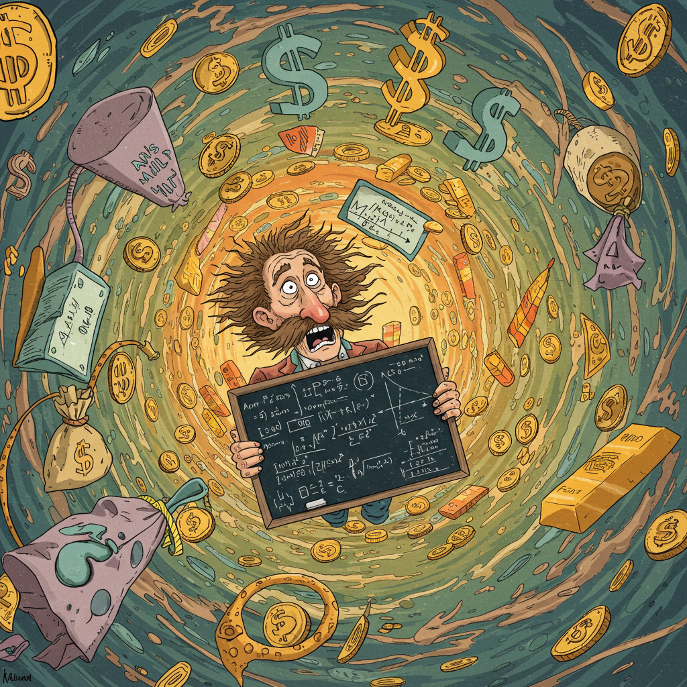

::: {.lang-switcher}
[English 🇬🇧](index.qmd){.lang-btn}
[Polski 🇵🇱](index-pl.qmd){.lang-btn .active}
:::

{width="95%" fig-align="center"}

## Wprowadzenie

W tym wpisie przyjrzymy się temu, jak z perspektywy matematyka wygląda praca w sektorze finansowym. Przeanalizujemy różne ścieżki kariery, kluczowe umiejętności (które wykraczają daleko poza umiejętność prowadzenia dowodów matematycznych) oraz realia odnalezienia się w tej branży.

## Ekosystem finansowy

Pierwsze zderzenie z rynkami finansowymi może przytłaczać. Wszystko wygląda jak chaotyczna plątanina liczb, krzyków (choć dziś, w erze handlu elektronicznego, krzyku na parkietach jest już niewiele) i hermetycznego żargonu. W gruncie rzeczy rynki to jednak dość proste ekosystemy, w których przedmiotem wymiany są kapitał i ryzyko. To platforma spotkania dla tych, którzy mają fundusze, ale brakuje im pomysłów na projekty, z tymi, którzy mają świetne projekty, ale nie mają na nie środków.

Głównych aktorów na rynkowej scenie możemy podzielić na kilka grup.

**Spekulanci** – to oni biorą na siebie ryzyko w nadziei, że trafnie przewidzą kierunek zmian cen. Ich obecność zapewnia płynność niezbędną do funkcjonowania rynku. Zwykli ludzie inwestujący swoje oszczędności emerytalne w indeksy giełdowe to również spekulanci. Zakładają, że długoterminowe wyniki gospodarki przewyższą inflację do czasu ich przejścia na emeryturę. Historycznie jest to bezpieczne założenie, ale wciąż obarczone niepewnością.

**Zabezpieczający się (Hedgers)** – czyli „poszukiwacze ubezpieczenia". Oni z kolei mierzą się już z jakimś realnym ryzykiem (np. rolnik obawiający się spadku cen pszenicy) i chcą się go pozbyć.

Pomiędzy nimi działają **Arbitrażyści**. Pełnią oni rolę „czyścicieli rynku”, wyłapując minimalne różnice cen tego samego aktywa w różnych miejscach. Jeśli złoto w Londynie jest tańsze niż w Nowym Jorku, kupią je tam, gdzie taniej, i natychmiast sprzedadzą drożej, dopóki ceny się nie zrównają.

Na koniec mamy **Pośredników** (brokerów czy animatorzy rynku – market makers), którzy dbają o to, by transakcja w ogóle doszła do skutku, pobierając za to drobną prowizję.

Dla matematyka taki ekosystem to wymarzony plac zabaw. Dlaczego? Ponieważ każda z tych form interakcji z rynkiem opiera się na niepewności – a jeśli jest coś, w czym jako matematycy stosowani czujemy się mocni, to właśnie w ubieraniu nieznanego w precyzyjne liczby.

## Dlaczego nas potrzebują?

Można zadawać sobie pytanie: po co instytucjom finansowym ktoś, kto przez pięć lat studiował wiązki geometryczne, zbiory otwarto-domknięte, procesy gałazkowe czy nielokalne operatory nieograniczone? Odpowiedź jest prosta – nowoczesne finanse opierają się na modelach, które w rzeczywistości są skomplikowanymi problemami matematycznymi. Hasło przewodnie to „finanse ilościowe" (quantitative finance), ale prawdę mówiąc, współcześnie wszystkie finanse są ilościowe.

Weźmy na warsztat **wycenę instrumentów pochodnych (pricing)**. Chcąc sprzedać komuś opcję (czyli np. prawo do zakupu akcji po określonej cenie za pół roku), musisz precyzyjnie określić jej dzisiejszą wartość. W grę wchodzą tu rachunek stochastyczny, równania różniczkowe cząstkowe i zaawansowane metody numeryczne. To nie jest wróżenie z fusów, tylko rozwiązywanie bardziej złożonego równania przewodnictwa cieplnego w realiach rynkowych.

Kolejny filar to **Zarządzanie Ryzykiem (Risk Management)**. Po kryzysie z 2008 roku skończył się czas działania „na oko”. Banki muszą z niemal stuprocentową pewnością wiedzieć, jak dotkliwe straty mogą ponieść podczas rynkowego tąpnięcia. Wymaga to teorii prawdopodobieństwa i statystyki z najwyższej półki do modelowania tzw. „grubych ogonów” (fat tails) – czyli rzadkich, ale katastrofalnych w skutkach zjawisk, których standardowe rozkłady nie są w stanie wyszukać i opisać.

Poza wyceną i ryzykiem, matematycy są mocno zaangażowani w **Handel Algorytmiczny (Algorithmic Trading)** – gdzie przy użyciu optymalizacji i przetwarzania sygnałów transakcje realizowane są w ułamkach sekund – oraz w **Optymalizację Portfela**, stosując algebrę liniową do poszukiwania idealnego balansu między oczekiwaną stopą zwrotu a ryzykiem.

## Różne oblicza quantów

Warto pamiętać, że pojęcie „quanta” kryje pod sobą bardzo zróżnicowane role. W zależności od Twoich predyspozycji możesz trafić do zupełnie innych światów. Niektóre stanowiska to czysta, „twarda” matematyka finansowa skupiona wokół wyceny derywatów. Inne z kolei są bliższe inżynierii oprogramowania, gdzie programista po prostu musi dodatkowo rozumieć, czym jest krzywa dochodowości (Yield Curve).

```{python}
# | echo: false
# | output: asis
# | collapse: true

from IPython.display import display, Markdown
import plotly.graph_objects as go
import dataclasses


@dataclasses.dataclass
class QuantType:
    skills: dict[str, int]
    description: str


job_skills = {
    "Front Office Quant": QuantType(
        skills={
            "Analiza danych": 1,
            "Inżynieria oprogramowania": 1,
            "Matematyka finansowa": 3,
            "Programowanie": 3,
            "Wiedza o rynkach": 3,
            "Regulacje i nadzór": 1,
        },
        description="Tworzy i wdraża modele matematyczne do wyceny, zarządzania ryzykiem i strategii inwestycyjnych bezpośrednio na biurkach handlowych (trading desks).",
    ),
    "Market Risk Quant": QuantType(
        skills={
            "Analiza danych": 2,
            "Modelowanie ryzyka": 3,
            "Matematyka finansowa": 2,
            "Programowanie": 1,
            "Wiedza o rynkach": 2,
            "Regulacje i nadzór": 2,
        },
        description="Projektuje i weryfikuje modele szacowania ryzyka rynkowego, upewniając się, że bank nie przekracza dopuszczalnych limitów i spełnia wymogi nadzoru finansowego.",
    ),
    "Credit Risk Quant": QuantType(
        skills={
            "Analiza danych": 2,
            "Modelowanie ryzyka": 3,
            "Matematyka finansowa": 3,
            "Programowanie": 2,
            "Metody numeryczne": 1,
            "Inżynieria oprogramowania": 1,
            "Regulacje i nadzór": 2,
            "Wiedza o rynkach": 2,
        },
        description="Analizuje ryzyko kredytowe, czyli prawdopodobieństwo niewypłacalności kontrahentów lub dłużników. Rola wymagająca silnych fundamentów statystycznych.",
    ),
    "Validation Quant": QuantType(
        skills={
            "Analiza danych": 1,
            "Matematyka finansowa": 3,
            "Programowanie": 1,
            "Walidacja modeli": 3,
            "Regulacje i nadzór": 3,
        },
        description="Rola typu 'wewnętrzna policja'. Odpowiada za niezależny przegląd i testowanie modeli stworzonych przez inne zespoły, by zapobiec ewentualnym błędom i stratom.",
    ),
    "Quant Researcher": QuantType(
        skills={
            "Eksploracja danych (Data Mining)": 2,
            "Programowanie": 2,
            "Uczenie statystyczne": 3,
            "Matematyka finansowa": 3,
            "Wiedza o rynkach": 3,
        },
        description="Stanowisko o charakterze naukowo-badawczym (think tank). Skupia się na poszukiwaniu nowych sygnałów rynkowych i udoskonalaniu metod wyceny aktywów.",
    ),
    "Algorithmic Trader": QuantType(
        skills={
            "Eksploracja danych (Data Mining)": 2,
            "Inżynieria oprogramowania": 2,
            "Mikrostruktura rynku": 3,
            "Programowanie": 3,
            "Wiedza o rynkach": 3,
            "Zarządzanie danymi": 2,
            "Uczenie statystyczne": 3,
        },
        description="Programuje i nadzoruje algorytmy realizujące transakcje na żywym rynku. Wymaga głębokiego zrozumienia mikrostruktury rynku.",
    ),
    "Quant Developer": QuantType(
        skills={
            "Inżynieria oprogramowania": 3,
            "Matematyka finansowa": 1,
            "Programowanie": 3,
            "Metody numeryczne": 3,
            "Wiedza o rynkach": 2,
            "Regulacje i nadzór": 1,
            "Zarządzanie danymi": 2,
        },
        description="Filar każdego zespołu ilościowego. Odpowiada za budowę ultraszybkich i stabilnych systemem informatycznych, które dźwigają skomplikowane obliczenia.",
    ),
}

all_skills = set()
for data in job_skills.values():
    all_skills.update(data.skills.keys())
all_skills = tuple(reversed(sorted(all_skills)))


tabs = all_skills
display(Markdown(":::{.panel-tabset}"))

for job_title, data in job_skills.items():
    display(Markdown("\n"))
    display(Markdown("### {}".format(job_title)))
    display(Markdown("\n"))
    display(Markdown(data.description))

    skill_values = [data.skills.get(skill, 0) for skill in all_skills]
    fig = go.Figure(
        data=[
            go.Bar(
                y=all_skills,
                x=skill_values,
                orientation="h",
            )
        ]
    )

    fig.update_layout(
        title=f"Poziomy umiejętności - {job_title}",
        xaxis_showgrid=False,
        xaxis=dict(tickmode="linear", tick0=0, dtick=1),
        width=600,
    )

    display(fig)

display(Markdown(":::"))
```

## Case Study: Od Jupyter Notebooka do produkcji

Aby dobrze zrozumieć, czym w praktyce różnią się poszczególne role analityczne (Quant Analyst) od programistycznych (Quant Developer), przyjrzyjmy się konkretnemu projektowi: **wyznaczaniu implikowanego rozkładu prawdopodobieństwa z cen opcji**.

To jeden ze standardów finansów ilościowych. Analizując ceny opcji dla różnych cen wykonania (strikes) przy danym terminie zapadalności, możemy odczytać, jak rynek szacuje prawdopodobieństwo osiągnięcia przez instrument bazowy określonej ceny w przyszłości. Od strony matematycznej opiera się to na twierdzeniu Breedena-Litzenbergera, które mówi, że funkcja gęstości prawdopodobieństwa (w świecie neutralnym wobec ryzyka) jest proporcjonalna do drugiej pochodnej ceny opcji względem ceny wykonania.

Wyobraź sobie, że masz podstawową wersję tego algorytmu napisaną w Pythonie w Jupyter Notebooku. Kod dopasowuje gładką krzywą (np. qubic spline) do cen opcji i liczy drugą pochodną numeryczną. To fajne ćwiczenie matematyczne, ale w warunkach komercyjnych taki skrypt to dopiero początek drogi.

Oto jak w tym miejscu rozchodzą się ścieżki Quanta i Quant Developera:

### Ścieżka Quant Analyst (Analityka)

Quant Analyst (QA) skupia się przede wszystkim na matematyce, modelowaniu oraz finansowych konsekwencjach wyników:

- **Valuation Quant (Wycena):** Będzie analizować założenia matematyczne. Czy wybrana metoda interpolacji gwarantuje brak arbitrażu statycznego (np. czy gęstość prawdopodobieństwa nie przyjmuje wartości ujemnych i sumuje się do 1)? Jak wykorzystać ten rozkład do wyceny bardziej skomplikowanych, niepłynnych opcji egzotycznych?
- **Risk Quant (Zarządzanie ryzykiem):** Spojrzy na model pod kątem zabezpieczeń. Jak na podstawie wyznaczonego rozkładu zidentyfikować ryzyko ogona (tail risk) w naszym portfelu i jak najtaniej zabezpieczyć je za pomocą opcji poza ceną (OTM)?
- **Quant Researcher (Badania):** Będzie szukać anomalii rynkowych. Stworzy takie rozkłady dla różnych terminów zapadalności, porówna je z danymi historycznymi i spróbuje znaleźć powtarzalne nieefektywności rynku, na których można zarobić.
- **Quant Trader (Handel):** Skupi się na samej egzekucji. Jak przełożyć wnioski z modelu na konkretne transakcje i jak kupić lub sprzedać opcje na rynku przy minimalnych kosztach transakcyjnych?

### Ścieżka Quant Developer (Wdrożenie)

Quant Developer (QD) skupia się z kolei na tym, jak ten matematyczny prototyp przekształcić w stabilny, skalowalny i bezpieczny system działający na produkcji:

- **Produktywizacja kodu:** QD bierze (potencjalnie chaotyczny) skrypt z notebooka i przepisuje go zgodnie ze sztuką inżynierii oprogramowania. Wprowadza klasy, statyczne typowanie, lintery, dba o dokumentację oraz pisze testy jednostkowe i regresyjne.
- **Integracja danych i wzorce projektowe:** Model musi pobierać dane rynkowe z różnych źródeł (np. Bloomberg, Reuters, bazy danych). QD projektuje architekturę aplikacji przy użyciu wzorców takich jak wstrzykiwanie zależności (Dependency Injection) czy adapter (Adapter Pattern), aby zmiana dostawcy danych nie wymagała modyfikacji samego modelu matematycznego.
- **Optymalizacja wydajności:** Obliczenia matematyczne (interpolacja, szukanie parametrów modeli) mocno obciążają procesor. QD analizuje wąskie gardła. Czasem wystarczy użyć biblioteki `scipy`, innym razem trzeba zaimplementować dedykowane, szybkie algorytmy (np. metodę Jaeckela dla zmienności implikowanej). Przy ekstremalnych wymaganiach wydajnościowych QD przepisuje krytyczne obliczenia do C++ lub Rusta i łączy je z Pythonem (np. za pomocą `nanobind` lub `PyO3`).
- **Współbieżność i limity API:** Jeśli wąskim gardłem jest pobieranie danych, QD wdraża programowanie asynchroniczne (`asyncio`). Musi przy tym bezpiecznie obsłużyć blokujące wywołania zewnętrznych bibliotek (`asyncio.to_thread`) oraz zaprojektować mechanizmy ograniczania zapytań (rate limiters, semafory), aby system nie został zablokowany przez API dostawcy danych.
- **Przetwarzanie wsadowe (Batch Processing):** Jeśli zespół ryzyka potrzebuje wyników dopiero na koniec dnia (EOD), nie ma sensu liczyć wszystkiego w czasie rzeczywistym. QD konfiguruje orchestrator (np. Airflow), który uruchamia obliczenia w nocy, zapisując gotowe wyniki do bazy danych.
- **Interfejs użytkownika i wizualizacja:** Gdy trader potrzebuje podglądu rozkładów na żywo na jednym ze swoich ekranów, QD buduje aplikację webową. Musi zdecydować o architekturze: czy wystarczy prosty dashboard w Streamlicie/Dashu, czy potrzebny jest podział na wydajne API (np. FastAPI) i nowoczesny frontend (np. React).

Choć w mniejszych zespołach lub przy niektórych projektach granice te się zacierają i jeden zaawansowany quant może pisać zarówno model, jak i kod produkcyjny, to te dwa podejścia – matematyczne i inżynieryjne – pozostają fundamentem nowoczesnego quant finance.

## Rzeczywistość codziennej pracy

Praca jako quant to jednak nie tylko pisanie eleganckich wzorów na tablicy. Większość czasu spędzisz na **kodowaniu i testowaniu**. Nawet najbardziej błyskotliwy pomysł jest bezwartościowy, jeśli nie da się go szybko zaimplementować lub jeśli testy na danych historycznych (backtesting) nie wykażą jego skuteczności. Kluczowe jest też oswojenie się z „brudnymi” danymi – pełnymi braków, błędów i wartości skrajnych, które czystego matematyka przyprawiłyby o zawrót głowy.

Niezwykle ważna jest **komunikacja**. Będziesz na co dzień współpracować z traderami czy menedżerami, którzy świetnie znają rynek, ale mogą nie odróżniać szeregu Taylora od piosenki Taylor Swift. Umiejętność prostego wytłumaczenia zachowania modelu, bez zasypywania rozmówcy greckich liter, to prawdziwy as w rękawie.

Do tego dochodzi **odpowiedzialność i zgodność z regulacjami**. W niektórych zespołach błąd w kodzie może w kilka minut kosztować firmę miliony dolarów. Na innych stanowiskach spędzisz z kolei długie tygodnie na opisywaniu założeń modelu w dokumentacji dla nadzoru finansowego, by dowieść, że Twoje algorytmy nie zachwieją stabilnością rynku. To praca wymagająca żelaznej dyscypliny i odporności na stres.

## Gdzie szukać pracy?

Gdzie szukać zatrudnienia na początku drogi? Opcji jest sporo, również lokalnie.

W **Polsce** mamy zaskakująco silną reprezentację sektora ilościowego – od oddziałów globalnych instytucji finansowych w największych miastach (takich jak UBS, BNY Mellon, Santander, Goldman Sachs, HSBC czy Revolut), po mniejsze, lokalne zespoły. Oczywiście głównymi światowymi centrami pozostają Londyn, New York i Hongkong, jednak rozwój pracy hybrydowej i zdalnej znacznie ułatwił start w międzynarodowych zespołach bez konieczności relokacji.

## Pytania i odpowiedzi

W trakcie dyskusji ze studentami i osobami stawiającymi pierwsze kroki w branży często pojawiają się podobne pytania. Poniżej przedstawiam te najciekawsze wraz z moimi odpowiedziami – mogą one pomóc lepiej zrozumieć specyfikę tej pracy:

### 1. Jak wygląda typowy dzień w tej pracy?

To zależy od pozycji, jaką się zajmuje. Istnieje wiele różnych „podgatunków” quantów – od takich, którzy pracują głównie z gotowymi danymi z systemów ryzyka i Excelem, po typowych programistów rozumiejących finanse. Ja obecnie pracuję na pozycji bliższej tej drugiej strony spektrum (jako Quant Developer), natomiast mam też doświadczenie bardziej analityczne.

Mój typowy dzień wygląda mniej więcej tak:

- **Rozpoczęcie dnia (ok. 1h):** Zaczynam od recenzji kodu (code review). Jestem odpowiedzialny za jakość techniczną i spójność projektową kodu pisanego przez quantów i mniej doświadczonych programistów.
- **Daily meeting (15 min):** Krótkie spotkanie statusowe całego zespołu – kto co robił poprzedniego dnia, czy ktoś ma jakieś blokady i czy musi się z kimś skonsultować. Zwykle po tym następują spotkania 1-on-1, aby dogadać szczegóły techniczne lub wymagania biznesowe.
- **Skupiona praca inżynierska (ok. 4h):** Czas poświęcony na programowanie, choć bywa przerywany różnymi bieżącymi tematami.
- **Popołudnie (spotkania):** Spotkania z menedżerami lub innymi zespołami z Nowego Jorku (NYC) – raportowanie postępów, ustalenia międzyzespołowe, rozwiązywanie zależności itp.

### 2. Czy ta praca jest stresująca lub wyczerpująca?

Dużo zależy od kultury pracy, zespołu, sposobu zarządzania oraz konkretnego projektu.

Generalnie im bliżej „pieniędzy” (czyli bezpośredniego handlu), tym więcej stresu. Najbardziej wymagająca pod tym względem będzie praca po stronie *buy-side* (fundusze inwestycyjne, hedge fundy, firmy tradingowe) lub w strukturach *front-office* instytucji *sell-side* (banki inwestycyjne). Po stronie zarządzania ryzykiem (risk management) bywa spokojniej, choć tam również zdarzają się napięte terminy związane z regulacjami, które narzucają presję.

Nawet przy dobrej atmosferze jest to praca wyczerpująca, ponieważ wymaga ciągłego wysiłku intelektualnego. Dla mnie osobiście jest to satysfakcjonujące, ale sprawia też, że przestrzeń na prywatne projekty mam głównie w weekendy. Wieczorami po pracy wolę postawić na odpoczynek – gaming, kino czy aktywność fizyczną.

### 3. Jakie są największe wyzwania podczas pracy jako Quant?

Największym wyzwaniem jest **łączenie trzech światów: matematyki, technologii i finansów**. To ogromna ilość wiedzy do przyswojenia i utrzymania w głowie. Rzadko zdarza się osoba, która jest wybitnym ekspertem we wszystkich tych trzech dziedzinach jednocześnie. Trzeba się specjalizować, dokonywać wyborów i nieustannie się uczyć – co bywa ekscytujące, ale czasem też potwornie męczące.

Drugim wyzwaniem jest **komunikacja**. Ta wspomniana żonglerka dziedzinami nie odbywa się tylko w Twojej głowie. Musisz komunikować się z ludźmi, którzy mogą znajdować się w zupełnie innym miejscu na styku tych trzech obszarów. Wyjaśnienie matematycznych zawiłości programiście lub technicznych ograniczeń traderowi wymaga dużej elastyczności.

### 4. Co daje największą satysfakcję?

To bardzo indywidualna kwestia. W projektach, w których uczestniczę, staram się stosować zasadę: *„Make It Work, Make It Right, Make It Fast”* (podział pracy na trzy etapy).

Dla mnie osobiście najwięcej satysfakcji niesie etap **„Make It Fast”** (optymalizacja). Jest to o tyle ciekawe, że na co dzień specjalizuję się głównie w Pythonie. Python słynie z bogatego ekosystemu bibliotek i szybkości pisania kodu, a niekoniecznie z wydajności wykonania. Wprowadza to jednak pasjonujący element optymalizacji kodu i ciągłego szukania kompromisów wydajnościowych, co niesamowicie mnie napędza.

### 5. Czy da się utrzymać pełne skupienie przez cały dzień pracy? Gdy koduję przez 2 godziny, potem jest mi coraz trudniej.

To zupełnie naturalne. Rzadko kto potrafi programować w pełnym skupieniu przez 8 godzin bez przerwy. W naprawdę dobry, produktywny dzień mam na koncie około 6 godzin czystej pracy inżynierskiej, a często bywają dni, gdy są to tylko 4 godziny.

Ponadto rzadko pracuję nad tylko jednym zadaniem. Proces tworzenia oprogramowania w dużych instytucjach wymaga czasu na recenzję kodu i testy, więc zazwyczaj prowadzę 3–4 wątki równolegle:

- jedno zadanie jest na ukończeniu (w fazie review),
- nad drugim intensywnie myślę i podejmuję decyzje projektowe,
- trzecie (bardziej techniczne/rutynowe) wykonuje w tle np. agent LLM.

Taka kontrolowana zmiana kontekstu pomaga mi utrzymać świeżość i skupienie, o ile nie skaczę między tematami zbyt chaotycznie. Na początku drogi (jako junior) naturalny model to raczej praca nad 1–2 tematami jednocześnie.

## Przemyślenia końcowe

Przejście z murów uczelni do dynamicznego świata finansów potrafi być sporym wyzwaniem, ale daje mnóstwo satysfakcji – zwłaszcza gdy widzisz, jak Twoje teoretyczne modele przekładają się na rzeczywiste procesy i decyzje rynkowe. Jeśli rozważasz tę ścieżkę, zacznij od solidnego opanowania Pythona lub C++, powtórzenia teorii prawdopodobieństwa i sięgnięcia po klasyczną literaturę branżową.

[Moje CV](../../resume/index.qmd)

## Dodatkowa literatura

### Książki popularnonaukowe

- [The Quants: How a New Breed of Math Whizzes Conquered Wall Street and Nearly Destroyed It -- Scott Patterson](https://www.amazon.com/Quants-Whizzes-Conquered-Street-Destroyed/dp/0307453383)
- [A Random Walk Down Wall Street -- Burton G. Malkiel](https://www.amazon.com/Random-Walk-Down-Wall-Street/dp/0393358380)
- [The Money Formula -- Paul Wilmott, David Orrell](https://www.amazon.com/Money-Formula-Finance-Science-Mathematicians/dp/1119358612)

### Biografie

- [A Man for All Markets -- Edward O. Thorp](https://www.amazon.com/Man-All-Markets-Street-Dealer/dp/0812979907)
- [The Man Who Solved the Market -- Gregory Zuckerman](https://www.amazon.com/Man-Who-Solved-Market-Revolution/dp/0593086317)
- [My Life as a Quant -- Emanuel Derman](https://www.amazon.com/My-Life-Quant-Reflections-Physics/dp/0470192739)

### Podstawy techniczne

- [Financial Calculus: An Introduction to Derivative Pricing -- Martin Baxter, Andrew Rennie](https://www.amazon.com/Financial-Calculus-Introduction-Derivative-Pricing/dp/0521552893)
- [Paul Wilmott Introduces Quantitative Finance -- Paul Wilmott](https://www.amazon.com/Paul-Wilmott-Introduces-Quantitative-Finance/dp/0470319585)
- [Stochastic Calculus for Finance I: The Binomial Asset Pricing Model -- Steven Shreve](https://www.amazon.com/Stochastic-Calculus-Finance-Binomial-Pricing/dp/0387401008)
- [Mathematical Modeling and Computation in Finance -- Cornelis W Oosterlee & Lech A Grzelak](https://www.amazon.com/Mathematical-Modeling-Computation-Finance-Exercises/dp/1786348055)

### Przygotowanie do rozmów kwalifikacyjnych

- [Frequently Asked Questions in Quantitative Finance -- Paul Wilmott](https://www.amazon.com/Frequently-Asked-Questions-Quantitative-Finance/dp/0470748753)
- [Quant Job Interview Questions and Answers -- Mark Joshi](https://www.amazon.com/Joshi-Interview-Questions-Answers-Second/dp/B00NBE74RY)
- [150 Most Frequently Asked Questions on Quant Interviews -- Dan Stefanica et al.](https://www.amazon.com/Frequently-Asked-Questions-Quant-Interviews/dp/173453124X)

### Kanały na YouTube

- [Computations in Finance](https://www.youtube.com/computationsinfinance)
- [Dimitri Bianco](https://www.youtube.com/@DimitriBianco)
