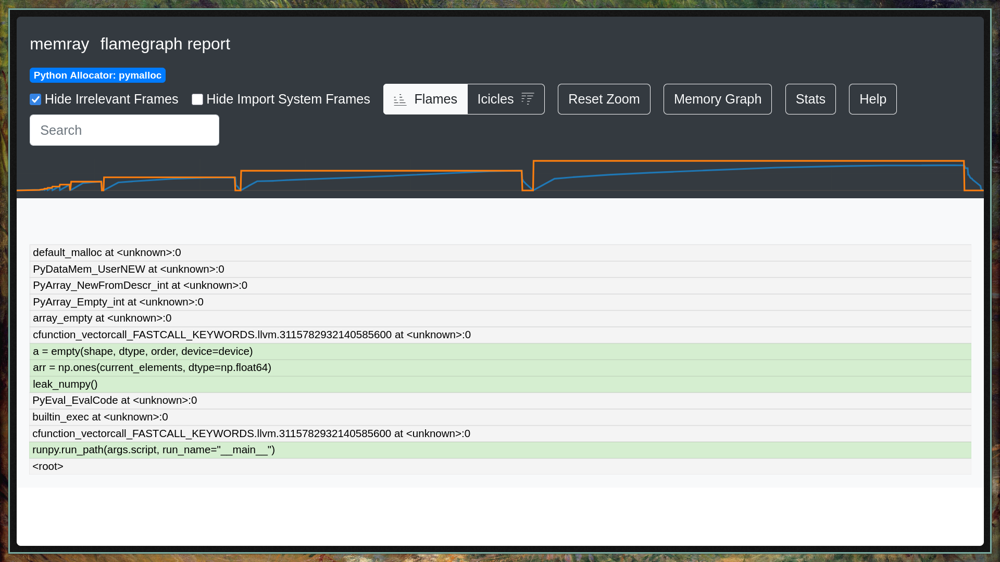
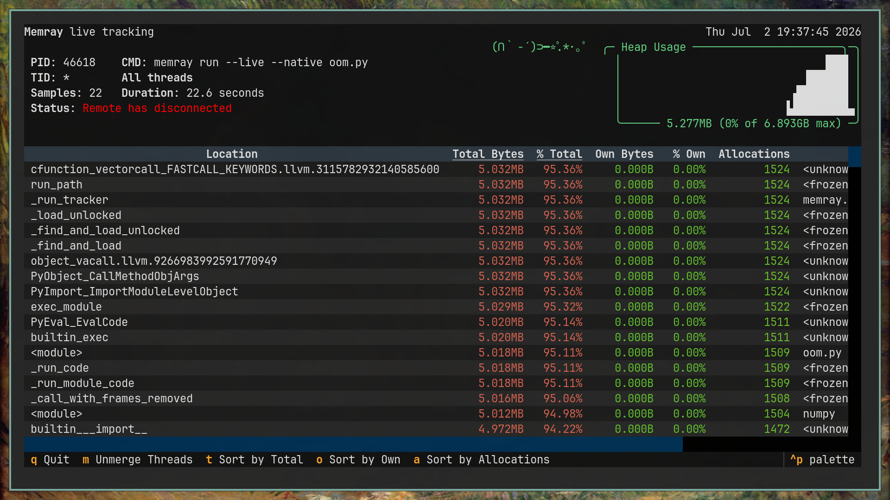
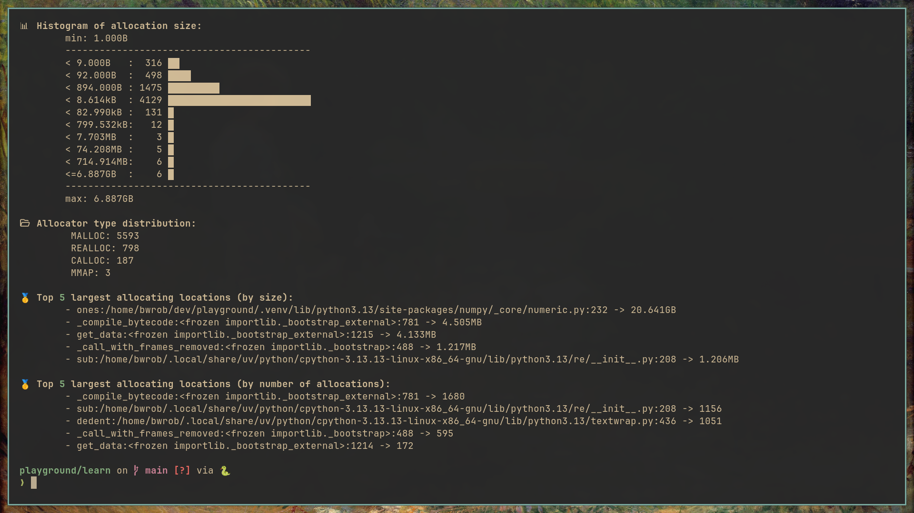
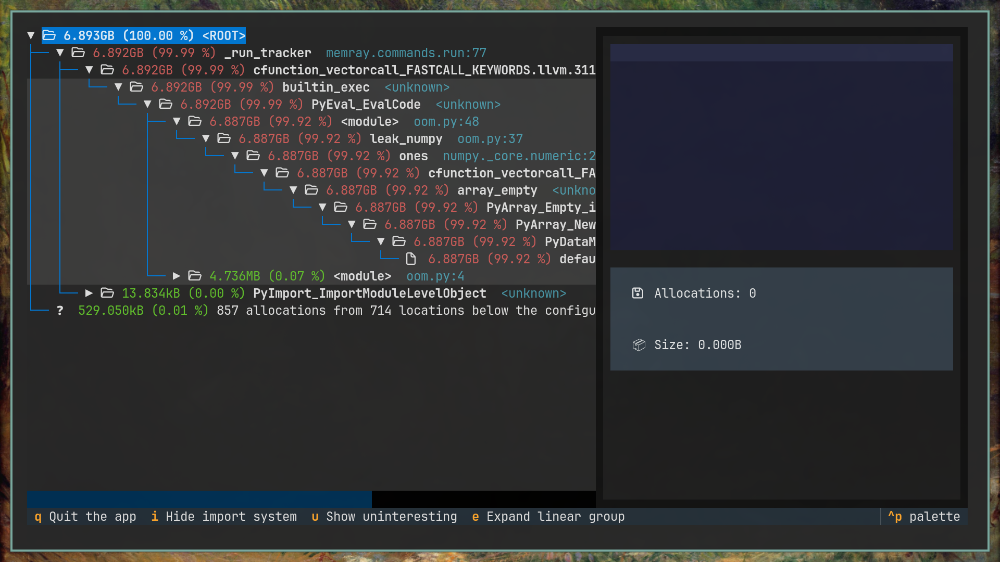

{width="98%" fig-align="center"}

Your Python process crashes in production with an unceremonious `Killed`. No
traceback, no log entry, no `MemoryError`.

Why? Because the Linux Out-of-Memory (OOM) killer operates at the kernel level: it fires
a `SIGKILL` (signal 9) directly at your PID. User-space applications cannot catch or
intercept signal 9.

Even worse: when the kernel pulls the trigger, memory profilers like **Memray** never
get the chance to flush their trace buffers to disk. Your profile data simply
evaporates.

How do we force Python to blow up with a catchable exception *before* the OS terminates
the process?

By setting a virtual memory ceiling with Python's built-in POSIX `resource` module.
This forces the runtime to raise a standard `MemoryError` when reaching the limit,
allowing Memray to exit cleanly and preserve its profile dump.

## A Memory Leak Example

Below is an example script that triggers an OOM using either a Python bytes object or a
NumPy array.

### Setting the Limit

First, we define a utility function to set the virtual memory limit.

```{python}
#| eval: false

import os
import resource
import secrets
import numpy as np


def limit_memory(max_bytes: int) -> None:
    """Set a virtual memory limit to trigger a Python MemoryError before OS SIGKILL."""
    resource.setrlimit(resource.RLIMIT_AS, (max_bytes, max_bytes))  # <1>
```

1. The `resource.setrlimit` function caps the virtual memory (`RLIMIT_AS`) available to
   the process. When memory usage exceeds this limit, the OS denies further allocations,
   raising a `MemoryError` instead of terminating the process.

### Pure Python Allocation

Next, we define a function that allocates memory using Python bytes.

```{python}
#| eval: false


def leak_python() -> None:
    """Trigger an OOM error by allocating progressively larger Python bytes objects."""
    print("Triggering OOM with a single pure Python bytes object...")
    current_size = 10 * 1024 * 1024  # Start at 10 MB
    data = None

    while True:
        if data is not None:
            del data  # Explicitly free memory before the next allocation  # <1>

        print(f"Attempting to allocate {current_size // (1024**2)} MB bytes object...")
        data = os.urandom(current_size)  # <2>
        current_size = int(current_size * 1.5)  # <3>
```

1. Freeing the previous allocation ensures the OOM is triggered by a single large
   allocation failing, rather than gradual accumulation.
2. `os.urandom` generates uncompressible bytes, preventing OS memory compression from
   masking the size of the allocation.
3. Grow by 50% each iteration.

### NumPy Allocation

We also define a function that allocates memory via NumPy.

```{python}
#| eval: false


def leak_numpy() -> None:
    """Trigger an OOM error by allocating progressively larger NumPy float64 arrays."""
    print("Triggering OOM with a single native NumPy array...")
    current_elements = (10 * 1024 * 1024) // 8  # 8 bytes per float64
    arr = None

    while True:
        if arr is not None:
            del arr  # Explicitly free memory before the next allocation

        mb_size = (current_elements * 8) // (1024**2)
        print(f"Attempting to allocate {mb_size} MB float64 array...")

        # This single C-level malloc will eventually fail and raise MemoryError
        arr = np.ones(current_elements, dtype=np.float64)  # <1>
        current_elements = int(current_elements * 1.5)  # <2>
```

1. NumPy arrays are backed by C/C++ allocations. When `np.ones` is called, it bypasses
   Python's memory manager and requests contiguous memory from the system. Without
   native profiling enabled, Memray would only track the Python wrapper, missing the
   underlying C allocation.
2. Grow by 50% each iteration.

### Running the Simulator

The entry point sets the memory limit and runs one of the allocation functions.

```{python}
#| eval: false
if __name__ == "__main__":
    limit_memory(1 * 1024**3)  # <1>

    try:
        if secrets.choice([True, False]):
            leak_python()
        else:
            leak_numpy()
    except MemoryError:  # <2>
        print(
            "\n[!] MemoryError caught. Memray can now flush the capture file to disk."
        )
```

1. Restricts the process to exactly 1 GB of virtual memory.
2. Catching `MemoryError` allows the script to exit gracefully. This is required for
   Memray to flush its buffers and write the profile data to disk.

## Running the Profiler

To capture native allocations, run the script with the `--native` flag:

```bash
memray run --native oom_simulator.py
```

This generates a binary capture file (e.g., `memray-oom_simulator.py.12345.bin`).

## Analyzing the Results

Memray provides several formats to analyze the generated binary file.

### HTML Flamegraph

You can generate an interactive HTML flamegraph to visualize allocations:

```bash
memray flamegraph memray-oom_simulator.py.12345.bin
```

This will produce an HTML file that you can open in a browser.

- **Python Allocation:** The graph will show a large block for `os.urandom`.
- **NumPy Allocation:** The graph will show the call stack going from Python into
  `numpy._core.multiarray.ones` (or `numpy.core` in pre-2.0 NumPy) and down to the C
  allocation function that breached the 1 GB limit.

{.lightbox
group="memray" description="HTML flamegraph showing the call stack of the NumPy
allocation."}

### Live Terminal UI

Memray includes a terminal UI (similar to `htop`) to view memory allocations in real
time:

```bash
memray run --native --live oom_simulator.py
```

This shows real-time memory spikes, top allocating files, and a running plot of heap
usage. It is useful for monitoring background services over SSH.

{.lightbox
group="memray" description="Terminal UI monitoring memory usage."}

### Statistics Summary

For a quick text summary of allocations, use the `stats` command:

```bash
memray stats memray-oom_simulator.py.12345.bin
```

This outputs a summary directly to the terminal, containing:

- Total memory allocated.
- The top allocating functions (both Python and C-level).
- A histogram of allocation sizes.

{.lightbox
group="memray" description="Terminal statistics summary of memory usage."}

### Terminal Tree View

You can also render an inverted call graph in the terminal using the `tree` command:

```bash
memray tree memray-oom_simulator.py.12345.bin
```

This visualizes the call relationships of functions that consumed memory. It helps trace
a memory leak straight to the source.

{.lightbox
group="memray" description="Call graph tree showing allocation hierarchy."}

::: callout-note

Download the companion script [here](../../assets/python/oom_simulator.py).

:::
