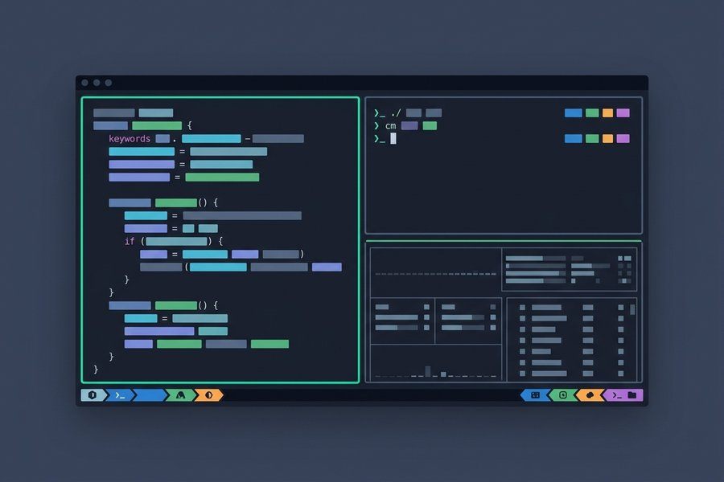

{width="98%" fig-align="center"}

> **Prefix Key:** `Ctrl + b` (press prefix, release, then press shortcut key).

## 1. Remote SSH Workflow

Connect directly into a persistent tmux session over SSH without opening an intermediate
shell:

```bash
ssh -t user@remote "tmux new-session -A -s work"
```

- `-t`: Force pseudo-terminal allocation (essential for interactive multiplexers).
- `tmux new-session`: Launch the tmux binary on the remote host.
- `-A`: Attach to session if it already exists; create it if it does not.
- `-s work`: Set the target session name to `work`.

## 2. Managing Sessions (CLI)

Control sessions directly from the terminal shell without entering tmux:

### Create a Session

```bash
tmux new -s <name> -d -- "<cmd>"
```

- `new`: Start a new session (`new` or `new-session`).
- `-s <name>`: Assign session name.
- `-d`: Run detached in background.
- `-- "<cmd>"`: Execute initial command upon startup (optional).

### Reconnect / Attach

```bash
tmux a -t <name> -d
```

- `a`: Attach to an existing session (`a` or `attach-session`).
- `-t <name>`: Target session name (omit to attach to the most recent session).
- `-d`: Detach other connected clients (forces session to resize to your display
  window).

### Quick Commands

- `tmux ls` — List all active sessions.
- `tmux kill-session -t <name>` — Kill session `<name>` (add `-a` to kill all *except*
  `<name>`).
- `tmux kill-server` — Terminate all sessions and shutdown tmux daemon.

## 3. Panes (Splits)

| Action                            | Shortcut              | Notes                                                 |
| --------------------------------- | --------------------- | ----------------------------------------------------- |
| Split vertically (side-by-side)   | `Ctrl+b` `%`          | Divides pane with vertical border                     |
| Split horizontally (top / bottom) | `Ctrl+b` `"`          | Divides pane with horizontal border                   |
| Navigate panes                    | `Ctrl+b` `Arrow Keys` | Moves focus in direction of arrow                     |
| Toggle zoom (fullscreen)          | `Ctrl+b` `z`          | Maximizes pane to full window; press again to restore |
| Break pane into new window        | `Ctrl+b` `!`          | Promotes current pane into its own separate tab       |
| Close current pane                | `Ctrl+b` `x`          | Closes pane (prompts `y/n` confirmation)              |

## 4. Windows & Session Controls

| Action                       | Shortcut           | Notes                                                      |
| ---------------------------- | ------------------ | ---------------------------------------------------------- |
| Detach from session          | `Ctrl+b` `d`       | Leaves programs running safely in background               |
| Switch session / window tree | `Ctrl+b` `s` / `w` | Interactive menu; navigate with `↑`/`↓`, `Enter` to switch |
| Rename current session       | `Ctrl+b` `$`       | Prompts for new session name                               |
| Create new window (tab)      | `Ctrl+b` `c`       | Opens a new shell tab                                      |
| Rename current window        | `Ctrl+b` `,`       | Prompts for new window name                                |
| Next / Previous window       | `Ctrl+b` `n` / `p` | Step through tabs sequentially                             |
| Jump to window by index      | `Ctrl+b` `0`..`9`  | Direct switch to window number                             |

## 5. Scrollback & Copy Mode

With mouse mode enabled (see config below), you can scroll and select text directly with
your mouse.

For keyboard-only navigation:

- Press **`Ctrl+b [`** to enter copy mode.
- Navigate with Arrow keys or `PageUp` / `PageDown`.
- Press **`Space`** to start selection, **`Enter`** to copy, and **`q`** to cancel.
- Paste copied text with **`Ctrl+b ]`**.

## 6. Essential `~/.tmux.conf`

Add these defaults to `~/.tmux.conf` for a modern, responsive terminal experience:

```tmux
set -g mouse on # <1>
set -g base-index 1 # <2>
set -g pane-base-index 1 # <3>
set -g history-limit 50000 # <4>
set -g default-terminal "tmux-256color" # <5>
set -s escape-time 0 # <6>
bind | split-window -h -c "#{pane_current_path}" # <7>
bind - split-window -v -c "#{pane_current_path}" # <8>
bind r source-file ~/.tmux.conf \; display "Reloaded ~/.tmux.conf" # <9>
```

1. **Mouse mode**: Click to focus panes, scroll with mouse wheel, and drag borders to
   resize.
2. **1-based window indexing**: Starts windows at 1 instead of 0, matching the number
   row on your keyboard (`Ctrl+b 1` for first tab).
3. **1-based pane indexing**: Starts pane indices at 1 for consistency with windows.
4. **History buffer**: Expands scrollback from default 2,000 to 50,000 lines.
5. **256-color & true color**: Ensures syntax highlighting in Neovim and modern TUIs
   looks rich and accurate.
6. **Zero escape delay**: Eliminates the delay when pressing `Esc` inside Vim / Neovim.
7. **Intuitive vertical split**: Uses `Ctrl+b |` to split side-by-side, opening inside
   the current directory.
8. **Intuitive horizontal split**: Uses `Ctrl+b -` to split top/bottom, opening inside
   the current directory.
9. **Fast reload**: Reloads configuration instantly via `Ctrl+b r` without restarting
   active sessions.
