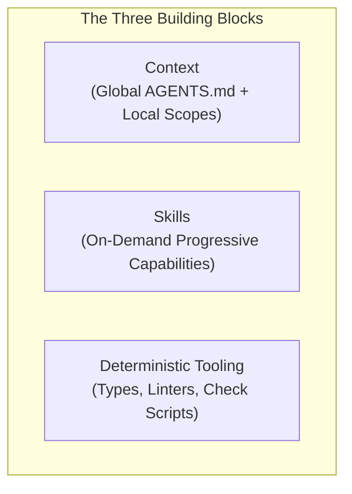
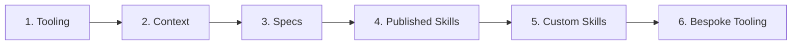

{width="98%" fig-align="center" .nolightbox}

Every AI coding tool comes with its own harness. When you install Cursor, Claude
Code, or Antigravity, the vendor supplies a default system prompt and standard tool
integrations.

The problem is simple: vendor defaults are generic. They know nothing about your
architecture, business needs, your deprecated libraries, or the edge cases that
you spent weeks solving.

Leaving your agent on default settings costs you real time and tokens. The model
drifts, introduces subtle regressions, and burns context tokens on repetitive
corrections.

You can fix this. You do not need to accept generic behavior. By building a harness
directly into your repository, you turn an unpredictable model into a reliable
pair programmer.

## Building Blocks

An effective repository harness rests on three distinct components:



### Context

Context represents the general instructions, project goals, and business domain you
provide to the model.

Keep your context small. Context is your most expensive asset. Every token in your base
prompt consumes working memory and incurs cost on every single turn. Computerphile has a
clear breakdown of
[why agent tokens become so expensive](https://www.youtube.com/watch?v=-0HRzXk8vlk) as
conversation turns compound.

Divide your context into two scopes:

1. **Global scope**: Project purpose, core practices, and non-negotiable boundaries.
   This belongs in a root [`AGENTS.md`](https://agents.md) file.
2. **Local scope**: Directory-specific conventions, module rules, or scoped path
   settings. Modern harnesses attach these instructions to specific file patterns so
   they load only when needed.

### Skills

Skills represent on-demand capabilities. Unlike global context, skills do not load into
memory all at once.

When a session begins, the agent inspects only the skill frontmatter: its name and
description. That metadata costs roughly fifty tokens per skill. The agent loads the
full instructions only when your prompt requires that specific workflow.

Here is a minimal skill example:

````markdown
---
name: verify-release
description: Run the pre-release checklist and verify distribution artifacts.
---

# Release Verification Workflow

1. Run the test suite: `uv run pytest`
2. Build the wheel: `uv run pyproject-build`
3. Inspect package metadata: `uv run twine check dist/*`
````

Skills come in several distinct flavors:

- **Wording and communication**: Enforcing specific output formats. Examples include
  `caveman` for terse terminal responses or `asd-ste100` for unambiguous technical
  prose.
- **General approach and methodology**: Guiding how the agent thinks and acts. Examples
  include `ponytail` or spec-plan-execute review cycles.
- **Specific functions and risk assessments**: Specialized diagnostic procedures, such
  as paper-tiger-elephant risk evaluations before architectural migrations.
- **Tool integrations**: Domain-specific scripts, test helpers, or wrappers built
  into your packages.

### Deterministic Tooling

Many developers rely on long prompt instructions to enforce coding standards. That is a
mistake. Probabilistic models drift. Deterministic tools do not guess.

Know the modern tooling ecosystem for your stack, and use it aggressively. In Python,
that means full type annotation coverage combined with a fast static type checker like
`pyrefly`.

Consider this riddle: What does this code do?

```python
def prepare_objects(data, preparer):
    objects = []
    for d in data:
        o = preparer(d)
        objects.append(o)
    return objects
```

What shape is `data`? What does `preparer` expect? What does it return? Neither a
human developer nor an AI model can tell without searching caller implementations.

Now consider the typed equivalent:

```python
import datetime as dt
from collections.abc import Callable

type YieldCurve = dict[float, float]  # <1>
type ParSwapQuote = tuple[dt.date, float]


def prepare_objects(
    data: list[ParSwapQuote],
    preparer: Callable[[list[ParSwapQuote]], YieldCurve],  # <2>
) -> list[YieldCurve]:
    objects: list[YieldCurve] = []
    for d in data:
        o = preparer([d])
        objects.append(o)
    return objects
```

1. Explicit domain type aliases document data structures.
2. Strict callable contracts prevent the agent from hallucinating object attributes.

This version requires more effort to write. Yet it is infinitely more readable. That
clarity helps human engineers, and it helps AI agents even more. When the type system
enforces the data contract, the agent cannot hallucinate invalid object attributes.

## Putting on the Harness

Your mileage may vary, but this is the exact sequence I follow when setting up a
project.

The most important word here is **bootstrap**. Make the agent help you put the
harness on itself.



### 1. Tooling First

Deterministic tooling is your most reliable investment and offers the highest ROI.
If you develop software, you must know the tools that surround your technology.

Configuring linters, formatters, and type checkers by hand can take time. Do not do it
manually. Use pre-made templates, or describe your desired standards and instruct the
agent to write the configuration for you.

Add your check commands to pre-commit hooks and CI pipelines. Create a single script
command (like `poe code-quality` or `make check`) and run it as often as possible.

### 2. Context

Next, write a minimal `AGENTS.md`. Focus on two critical elements:

1. What the project is trying to achieve.
2. The mandate that all code must pass the deterministic quality checks defined in
   step 1.

Keep it concise and information-dense. Context is your most expensive asset.

Direct the agent to begin every session with a quick rediscovery pass: inspect what
you are building, check git status, and read relevant tests. Never cram twenty
formatting rules into `AGENTS.md`. Let your linters and type checkers enforce
mechanical standards.

### 3. Spec-Driven Development

Establish your own practices for specification.

An agent will implement the wrong solution with complete confidence if requirements
are vague. Before asking an agent to write code, write down three things:

- **Intent**: The problem you are solving.
- **Constraints**: What cannot break.
- **Acceptance criteria**: The tests that prove success.

Resolving disagreements in a short spec document takes minutes. Fixing a 500-line pull
request built on a misunderstanding takes hours.

### 4. Published Skills

The ecosystem now offers thousands of community skills (`npx skills install`).

A new hype wave appears every week. Approach published skills with care:

- **Security risks**: Community skills often contain executable scripts and shell
  commands. Always audit the underlying code before running them.
- **Skill bloat**: Installing 100 skills confuses both the agent and the developer.
  The model struggles to select the right tool when descriptions overlap.

Experiment, evaluate what works, and keep your skill inventory lean.

### 5. Custom Skills

Most modern agentic tools include skill-authoring capabilities in their default
harness. Use them.

When you notice yourself typing the same prompt instructions three times, turn that
workflow into a skill. Describe the procedure to the agent. Let the agent scaffold the
skill file. Test the workflow, refine the steps, and commit the skill to your
repository.

Treat custom skills as version-controlled code. Review modifications to them through
pull requests just as you would application code.

### 6. Bespoke Tooling

Build your own bespoke tooling. You understand the unique character of your project
better than anyone else.

Ask yourself these questions:

- What hidden conventions do experienced team members follow?
- What architectural invariants must we guarantee?
- Where do repeated mistakes happen?

Spend half a day identifying those pain points. Then instruct your agent to write a
custom lint script or verification tool that detects violations. Wire that tool
directly into your local check command.

## Here Be Dragons

A healthy dose of realism is necessary when working with agentic systems:

- **Developer skills decay**: If you outsource all reasoning and debugging to the
  agent, your own edge dulls. You must understand the generated code deeply enough to
  catch subtle algorithmic failures or silent memory leaks during review.
- **The "solved software" myth**: Marketing pitches claim software production is solved
  and everyone can just prompt. The fantasy of a dark factory where code writes itself
  without human intervention is an illusion. Real engineering remains hard.
- **Token costs are real**: Multi-turn agent loops burn tokens fast. If your base
  context is bloated or your agent loops through ten failed test runs, your API bills
  compound rapidly.
- **Review fatigue and rubber-stamping**: Agents generate hundreds of plausible lines
  in seconds. The bottleneck shifts from writing code to auditing it. If tired engineers
  rubber-stamp massive diffs, subtle technical debt rapidly pollutes the repository.
- **The "set it and forget it" trap**: A repository harness is not a static setup.
  As codebases evolve, libraries update, and model capabilities shift, your rules,
  skills, and deterministic gates require continuous maintenance.

Software engineering is evolving from line-by-line typing into system design,
constraint specification, and architectural review. Build rigid rails. Let
deterministic tools catch mistakes. Keep human judgment where it matters most:
on intent, architecture, and correctness.

## References

- [How to set up your repository for AI coding agents](https://ainativesoftware.engineering/harness) --
  Alfonso Graziano's guide on repository context layers and deterministic feedback gates
  from *AI-Native Software Engineering* (O'Reilly).
- [Addy Osmani's Blog](https://addyosmani.com/blog/) --
  Essays on agent harness engineering, agent skills, and workflow orchestration.
- [Why AI Tokens are so Expensive](https://www.youtube.com/watch?v=-0HRzXk8vlk) --
  Computerphile video on token costs and runaway context growth in agentic loops.
