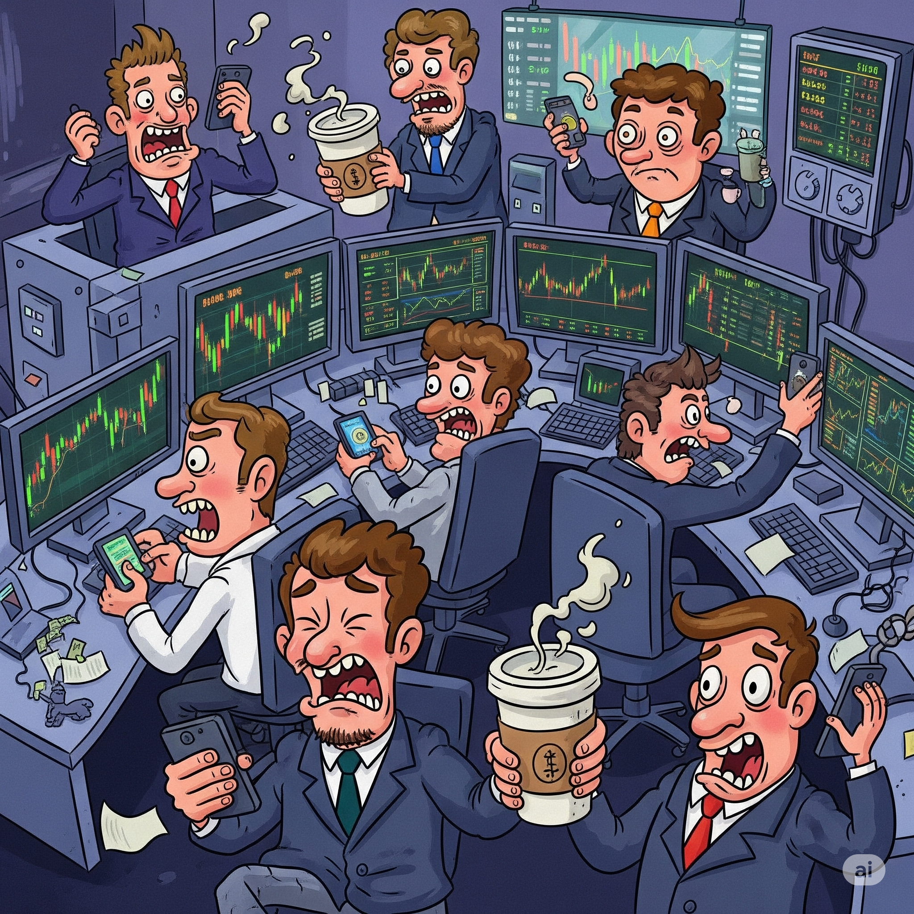

{width="95%" fig-align="center"}

::: {.callout-note}
This post is a reprint of my graduate thesis for postgraduate studies in Investment Banking at the Warsaw School of Economics.
:::

## Merger Arbitrage

Financial markets are where different participants interact through
trading. The two primary things being traded are capital and risk.
Capital is the money exchanged for the expectation of a future return,
while risk is the uncertainty associated with that return.

### Arbitrageurs in Financial Markets

Market participants can be categorized based on their motivations for
engaging in markets:

-   *Speculators* -- They are willing to assume risk with the goal of
    generating a profit. They adopt a positional view on the assets and
    instruments they acquire or sell. This category includes everyone
    from specialized investment funds to individual investors saving
    for retirement.

-   *Hedgers* -- Their aim is to mitigate their existing risk exposure.
    They may be consumers or producers of the underlying asset, or
    speculators seeking to adjust their risk profile.

-   *Market makers* -- They provide liquidity, profiting from the
    bid-ask spread, deal premiums, fees, and commissions.

-   *Arbitrageurs* -- They aim to capitalize on price discrepancies
    between different markets or instruments. They do not have a
    positional view on the market but try to identify and exploit
    inefficiencies in the market.

Among these four groups, arbitrageurs are arguably the most
sophisticated market participants. The *efficient market hypothesis*
assumes that market prices reflect all available information. However,
markets are not always perfectly efficient. Temporary inefficiencies can
occur due to things like information asymmetry, transaction costs, or
behavioral biases. Arbitrageurs seek to exploit these inefficiencies to
generate a profit. This is typically achieved by simultaneously buying
and selling related assets in different markets or instruments, to
profit from the price differences.

### Mergers and Acquisitions

Mergers and acquisitions (M&A) is a general term that refers to the
consolidation of companies or assets through various types of financial
transactions. A merger is a term used to describe the combination of two
companies into a single entity, while an acquisition refers to the
purchase of one company by another. The motive for both is that
consolidation would create synergies, which would lead to increased
efficiency and profitability. This includes:

-   **Increased market share** -- Companies increase their market share
    and gain a competitive advantage.

-   **Economies of scale** -- Larger companies can achieve economies of
    scale, reducing costs and increasing profitability.

-   **Diversification** -- Companies can diversify their product lines
    and reduce risk by entering new markets.

-   **Horizontal integration** -- Companies acquire players upstream or
    downstream in the supply chain, increasing their control over the
    production process.

-   **Access to new technology** -- Companies can acquire new technology
    or intellectual property, enhancing their competitive position.

### Merger Arbitrage {#sec:merger_arbitrage}

Merger arbitrage is an investment strategy that involves trading in the
stocks of companies involved in mergers and acquisitions (M&A). There
are two main types of M&A transactions -- *cash offers* and *stock (or
share-for-share) offers*. The basic investment premise of an arbitrageur
in each of those can follow these hypothetical scenarios:

-   **Cash offer** -- Company $A$, the *buyer*, announces an acquisition
    of company $B$, the *target*, for a cash payment of $\$30$ per
    share. The last trading price of company $B$ was $\$20$. After the
    announcement, the price of company $B$ rises to $\$28$. There is
    still a $\$2$ *spread* between the current price and the acquisition
    price. This represents the risk that the acquisition may not be
    completed. Merger-arbitrage traders will buy shares of company $B$
    at $\$28$ and wait for the acquisition to be completed. They would
    pocket the $\$2$ spread if the acquisition is successful.

-   **Stock offer** -- Company $A$ announces an acquisition of company
    $B$ for a share-for-share exchange with a ratio of $0.25$. This
    means that $A$ is offering to exchange one of its shares for four
    shares of company $B$. The last trading price of company $B$ was
    $15\%$ of the price of company $A$. After the announcement, the
    price of company $B$ rises to $22\%$ of the price of company $A$.
    Merger-arbitrage traders will buy shares of company $B$ at $22\%$ of
    the price of company $A$ and at the same time short a quarter of the
    equivalent amount of shares of company $A$. They would pocket the
    $3\%$ spread if the acquisition is successful.

Merger arbitrage is a popular strategy among hedge funds and
institutional investors, as it can provide attractive risk-adjusted
returns. It hinges on the investor's ability to accurately assess the
likelihood of a merger or acquisition being completed successfully. This
requires a deep understanding of the regulatory environment, the
motivations of the companies involved, and the potential impact on their
stock prices. Institutional arbitrageurs, like hedge funds, are often
present in the courtroom during the merger process. They analyze the
legal documents, financial statements, attend hearings, and compare the
particular merger with similar transactions in the past. F

### Risk and Return {#sec:merger_arbitrage_risk_and_return}

The main components crucial for evaluating an investment are:

-   **Expected return** -- The expected return is the average return
    that an investor can expect to earn from an investment over a
    specific period of time.

-   **Time horizon** -- The time horizon is the period of time over
    which an investor expects to hold an investment before selling it.

-   **Risk** -- Risk is the uncertainty associated with the expected
    return of an investment, often measured by the standard deviation of
    the returns.

After a merger announcement, the volatility of the target company
decreases after the initial spike. Another way to think about it is that
the portfolio of the arbitrageur is not a portfolio of stocks but a
portfolio of merger spreads. The decreased risk and market neutrality
make even a more modest return attractive.

The arbitrageur needs to be wary of the time horizon of the investment,
as the merger may take a long time to be completed. In such a case, the
spread they managed to capture may underperform the risk-free rate over
that period. Historically, the average merger arbitrage spread has been
around $5\%$ to $10\%$ per year, depending on market conditions and the
specific deals involved. The source of this surplus return is explained
by other sources of risk, as we'll see in the next post.

## Risk Management {#ch:risk_management}

Modern finance is built on the principle that risk can be
quantified, analyzed, managed, and traded. The primary
concepts employed in risk quantification are volatility and correlation.
However, for merger arbitrage, these concepts and their related metrics
from modern portfolio theory aren't very useful. This is largely due to
the relatively uncorrelated nature of the merger arbitrage strategy. The
goal of pursuing such strategies is to generate alpha, which exhibits
low correlation with broader market movements. While this can be a big
advantage, especially when the market is unstable, it also creates
unique risk management challenges.

### General Risk Management Metrics

When a risk officer assesses a portfolio's risk, they use a range of
metrics. A key consideration is the portfolio's target return, which
directly influences the risk appetite, i.e., the amount of risk the
portfolio manager is willing to assume. The most common risk metrics
used in the industry include:

-   **Sensitivities** -- These metrics measure how the value of a
    portfolio changes in response to changes in underlying factors. The
    most common sensitivities are the Greeks, which quantify the
    sensitivity of the portfolio value to changes in underlying asset
    prices, interest rates, and volatility. There are also more
    structured measures that involve multi-dimensional market objects,
    like DV01 (1 basis point parallel change in the yield curve) or CS01
    (1 basis point parallel change in the credit spread curve).

-   **Variance-based measures** -- These metrics assess the risk of a
    portfolio by examining the statistics of its returns. Common
    variance-based measures include standard deviation and beta. Beta is
    a measure of correlation between the portfolio and the general
    market, typically materialized as a benchmark index such as the
    S&P 500. Another important measure is the Sharpe ratio, which
    evaluates the risk-adjusted return of a portfolio. It is calculated
    as the excess return of the portfolio over the risk-free rate,
    divided by the standard deviation of the portfolio returns.

-   **Quantile-based measures** -- These metrics gauge the risk of a
    portfolio by analyzing the distribution of its returns. The most
    common quantile-based measures are Value at Risk (VaR) and Expected
    Shortfall (ES). VaR represents the maximum potential loss on a
    portfolio over a given time horizon with a specified confidence
    level. ES, also known as Conditional VaR, represents the expected
    loss conditional on the loss exceeding the VaR.

-   **Exposure limits** -- These constraints define the maximum amount
    of risk that can be assumed for a single position or within a
    particular market segment. Adhering to these limits is crucial for
    maintaining a diversified portfolio and preventing excessive
    concentration in any single position. This is typically expressed as
    the maximum potential loss that can be incurred.

-   **Liquidity measures** -- These metrics quantify the speed and ease
    with which a position can be entered or exited. Even the best
    investment prospects are worthless if they cannot be executed at a
    scale justifying research and infrastructure costs. On the other
    hand, if conditions turn unfavorable, a swift exit is crucial to
    limit losses. Examples of liquidity measures include trade volume
    and the time required to liquidate a position.

-   **Stress testing** -- This technique evaluates the risk of a
    portfolio by assessing its performance under extreme market
    conditions. The scenarios applied to the portfolio can be either
    synthetic (e.g., a $10\%$ drop in the S&P 500, considering asset
    correlations) or historical (e.g., the 2008 financial crisis).
    Stress testing exercises are important for determining capital
    requirements and are often mandated by regulators. It involves
    analyzing not only the portfolio's performance under the prescribed
    scenario but also the behavior of other risk metrics.

Risk management for a portfolio depends heavily on its characteristics;
there's no one-size-fits-all approach. The selection of appropriate risk
metrics depends on the portfolio manager's risk appetite and the
specific investment strategy. Strategies that are highly specialized,
like arbitrage, may require a different set of risk metrics and special
considerations to be taken into account.

### The Case of Merger Arbitrage

Let's look at the specifics of risk management for merger arbitrage
portfolios.

*Sensitivities* can be particularly important, especially when
derivatives are used to leverage positions. However, standard derivative
valuation models may not be suitable for stocks involved in M&A
transactions. This is evident in cash mergers, where the stock price is
bounded by the cash offer price. Consequently, the Black-Scholes model's
assumption of a log-normal distribution of the stock price is violated.
We will examine an alternative option pricing model better suited for
stocks involved in M&A in later sections.

*Variance-based and quantile-based measures* have limited utility for
merger arbitrage portfolios. A fundamental assumption underlying these
metrics, which rely on statistical analysis of returns time series, is
stationarity---the invariance of the statistical properties of the
returns process. This assumption is crucial for historical approaches to
estimating distribution-based metrics. However, a stock's price dynamics
change dramatically following a merger announcement, making it
unreasonable to assume that its past behavior is predictive of future
performance. This means that
historically observed standard deviation, beta, and VaR are not reliable
measures of risk for merger arbitrage portfolios.

A rigorous approach to *position limits* is essential for the successful
execution of a merger arbitrage strategy. Taking on a large position in
a single stock can be very risky, given the non-negligible probability
of a deal's failure. Therefore, portfolios should be diversified across
a range of stocks and sectors. We discuss this in more detail in the
next section.

*Liquidity* and order book depth are crucial for merger arbitrage
portfolios, as they can significantly impact the execution of trades.
Usually, a merger offer includes a significant premium to the last
trading price, which causes the stock price to jump up close to the
offer price. This incentivizes long-term investors to sell their shares,
as from their perspective, there is little upside in holding the stock.
The arbitrageur, on the other hand, is interested in the spread between
the offer price and the stock price -- they provide liquidity to the
sellers. Overall liquidity, trading volume, and bid-ask spread need to
be monitored closely by the arbitrageur from this point onwards. If an
event that endangers the merger occurs, there might not be enough
buyers, and the arbitrageur may be unable to exit their position without
incurring significant losses.

Special attention should be given to *stress testing* of merger
arbitrage portfolios. The prices of stocks under merger offer
revert to their historical correlation with the market during periods of
market distress. This presents a unique modeling challenge, and merger
arbitrage portfolios need to be treated separately from other
portfolios.

Let's get into some of the specific considerations and unique aspects
of risk management for merger arbitrage portfolios.

## Exposure Limits and Expected Losses

Exposure limits are a critical part of risk management for merger
arbitrage portfolios. A key aspect of managing a merger arbitrage
strategy is determining the maximum amount of risk that can be taken in
a single position or a particular market segment. Limiting exposure
reduces the probability of incurring significant losses from a single
deal break.

This obviously means that a pure merger arbitrage portfolio needs to
invest in multiple deals at once. The portfolio managers target a
specific number of deals to be included in their strategy. Arbitrageurs
can be \"concentrated\" (few deals, in-depth analysis) or
\"diversified\" (many deals, spreading risk). According to a survey of
risk management practices, merger arbitrageurs held an average of 36
positions, with a minimum of 25 and a maximum of 40. The maximum viable
position size for each holding should be determined based on the
specific investment goals.

The most straightforward approach to position limits is to cap the size
of a single merger position within a portfolio, such as a 5% limit.
These limits can be strict, meaning they are never exceeded, or
flexible, allowing them to be exceeded if the arbitrageur has a strong
belief in a deal's success. In the latter case, there are usually two
types of limits: a hard limit, which is the absolute maximum position
size (red light), and a soft limit, which is the maximum position size
that can be exceeded with justification (yellow light).

A more advanced approach to position limits is to set them based on the
expected loss from a position and limit that to a certain percentage of
the portfolio. We present a simplified procedure for calculating these
limits, in the next sections.

There are other dimensions to consider when setting exposure limits. For
example, the portfolio manager may want to limit the maximum exposure to
a single sector or industry, which can help mitigate the risk of
sector-specific events affecting multiple positions. This is, however,
an easier task in theory than in practice, as the merger arbitrage
universe is relatively small, and many deals are concentrated in a few
sectors. As different industries go through cycles semi-independently,
mergers might be concentrated in a few sectors at a time, making
diversification difficult.

Limits can also be set on the types of transactions, such as restricting
exposure to leveraged buyouts (LBOs), stock-for-stock transactions,
etc., depending on the views and goals of the portfolio manager or the
firm.

Another important risk management concept that is closely related to our
calculation of exposure limits is the expected loss from a position. In
the context of merger arbitrage, expected loss is the
probability-weighted loss that an arbitrageur may incur if a merger deal
fails to close. This is akin to the expected loss in the case of
counterparty credit risk, where the expected loss is calculated as the
product of the probability of default and the loss given default.

### Estimation of Probabilities of Closing

Determining the probability of a merger closing is a crucial and often
the most difficult step in the merger arbitrage process. Even for
experienced arbitrageurs, estimating the probability of a merger closing
involves a lot of guesswork and subjective judgment. The arbitrageur
assumes the merger will close and will profit only if it does. They need
to determine the influence of various factors that may cause a deal
break. This includes:

-   **Financing risks** -- The financial health of the acquirer and
    their ability to raise capital is crucial for the success of the
    merger. This is especially important for leveraged buyouts (LBOs),
    where the acquirer relies heavily on debt financing.

-   **Changes in market conditions** -- Even though merger arbitrage is
    primarily an event-driven, market-neutral strategy, the overall
    market or specific industry conditions can have a significant impact
    on the success of a merger. A significant decline in the business
    environment is called *material adverse change* in legal terms. The
    merger agreement may include provisions that allow the acquirer to
    back out of the deal if a material adverse change occurs.

-   **Regulatory risks** -- Regulatory approval is often a significant
    hurdle for mergers and acquisitions, especially in industries with
    high levels of competition or where the merger may create a
    monopoly. In some instances, for example, cross-border deals, the
    merger of big entities can be politicized and lead to significant
    delays or even cancellation of the deal.

-   **Market cap sizes of the acquirer and target** -- A merger is more
    likely to succeed if the acquirer is significantly larger than the
    target. According to historical data, the probability of a merger
    closing is higher when the acquirer is included in large-cap indices
    such as the S&P 500 or the Russell 1000.

-   **Shareholder and management sentiment** -- Long-term holders on
    either side of the deal may oppose the merger, especially if they
    believe it will not be beneficial for the company. Successful
    shareholder opposition campaigns are, however, rarely successful,
    especially if the merger premium over the trading price is
    significant.

The arbitrageur needs to consider all of these factors and assign a
probability of closing to each deal. They may also use historical data
regarding the proceedings of similar deals and statistical models to
help estimate the probability of a merger closing. Another source of
information could be overall market sentiment, which can be gauged from
the media coverage of the deal and market pricing, for example, option
prices.

### Estimating severity of loss

The severity of loss from a merger arbitrage position is the loss that
the arbitrageur incurs if the merger fails to close. Severity is
analogous to the loss given default (LGD) in credit risk management. The
equation for calculating the severity is deceptively simple:

$$L =P_{\mathrm{p}} - P_{\mathrm{s}}$$

where $P_{\mathrm{p}}$ is the arbitrageur's purchase price, and
$P_{\mathrm{s}}$ is the estimated price of the stock at the time of the
merger failure. The hard part is estimating $P_{\mathrm{s}}$, which
might involve even more guesswork than estimating the probability of
closing. The purchase price for the arbitrageur has already included the
merger premium, but there might have already been some rumors about the
possible merger before the announcement, and the stock price might have
already reflected some of the merger premium. Or the merger proceedings
might unearth some negative information about the target company that
was not public previously and affect the outlook on the target. The
arbitrageur needs to be conservative and apply punitive estimates of
$P_{\mathrm{s}}$ to avoid underestimating the severity of loss.

### Calculating Exposure Limits and Expected Losses

Following the above considerations, the next step is straightforward.
The estimate of the *expected loss* from a position is calculated as
follows:
$$\mathbf{E}[L] = ( 1 - \mathbf{P}_{\mathrm{success}} ) \cdot L$$ where
$\mathbf{P}_{\mathrm{success}}$ is the probability of the merger
closing, and $L$ is the loss incurred if the merger fails.

The *severity-based position limit* is calculated as a percentage of the
portfolio's value and is set such that the severity of loss does not
exceed a certain threshold.

## Stress Testing

As emphasized in previous chapters, merger arbitrage portfolios exhibit
low sensitivity to broader market movements. It is useful to
conceptualize a merger announcement as a phase transition wherein the
target company's stock price loses its historical correlation with the
general market and its industry.

However, certain events can cause the stock price to revert from this
phase transition and resume behaving like a typical stock. The most
obvious example is the failure of the merger. Other events can also
trigger this shift. For instance, during periods of market distress,
risk arbitrage returns tend to become positively correlated with the
market. This dual effect -- uncorrelated returns in normal times and
positive correlation with the market during distress -- needs to be
addressed in the context of stress testing. The whole goal is to assess
the risk of a portfolio in extreme market conditions, so the modeling
approach should take into account any non-linearities and
regime-switching phenomena the portfolio may exhibit.

### Merger Arbitrage as a Short Put Option

The described behavior of arbitrage strategies resembles that of a short
position in an out-of-the-money (OTM) put option on a market index. This
regime-switching phenomenon was initially observed by Mitchell and Pulvino,
who noted that merger arbitrage performs poorly in
sharply declining markets. They propose to model the merger arbitrage
returns using a *piecewise-linear CAPM-type model* (broken-stick
regression), i.e.,

$$\begin{aligned}
R_{\mathrm{Risk Arb}} - R_f &= (1 - \delta)[\alpha_{\mathrm{Mkt Low}} + \beta_{\mathrm{Mkt Low}}(R_{\mathrm{Mkt}} - R_f)] \\
&+ \delta[\alpha_{\mathrm{Mkt High}} + \beta_{\mathrm{Mkt High}}(R_{\mathrm{Mkt}} - R_f)],
\end{aligned}$$

where $\delta$ is an indicator function -- equal to one
if the excess return is above a threshold level and zero otherwise. To
ensure model continuity, it needs to be imposed that the two linear
functions are equal at the threshold level, which translates into the
following equation:

$$\alpha_{\mathrm{Mkt Low}} + \beta_{\mathrm{Mkt Low}}(\mathrm{Threshold}) = \alpha_{\mathrm{Mkt High}} + \beta_{\mathrm{Mkt High}}(\mathrm{Threshold}) .$$

According to their study, in instances where the market index drops by
more than $4\%$ in a month, the average merger arbitrage portfolio
suffers a decline as well, with an average beta value of around $0.5$.
In a bullish market, the average beta is essentially zero, so the
strategy misses the market upside. This means the merger arbitrage
alpha is partly compensation for taking on downside market risk without
getting the upside. This is analogous to the arbitrageur underwriting
uncovered market index put options.

A simple strategy to mitigate merger arbitrage losses involves buying
out-of-the-money index put options. While these options usually expire
worthless (resulting in the loss of the option premium), they can offset
losses from collapsing deals during market downturns. This strategy
improves the risk profile but slightly lowers returns in most market
conditions due to the cost of the options.

Managing downside risk with equity put options may be insufficient, as
this method often overhedges but underhedges when the hedge is most
needed. More sophisticated models were developed to model arbitrage
strategy returns during market downturns. For instance,
Tashman proposes an approach using finite mixtures that
includes multiple explanatory variables. Despite the complexity of the
model, the main conclusion remains the same: the merger arbitrage
strategy exhibits a regime-switching behavior, with a beta of around
$0.39$ during market downturns and a beta of around $0.01$ during normal
times.

### The Practice of Stress Testing

The above findings suggest a proper way to stress test a merger
arbitrage portfolio. The arbitrageur can mimic the regime-switching
behavior of the portfolio by substituting the arbitrage spread positions
with a short put option on the market index for certain risk-management
calculations. More specifically, the position should be represented as:

-   *A merger spread*, i.e., itself, for purposes of calculating market
    sensitivities, standard deviation, Sharpe ratio, position limits,
    and normal quantile-level VaR.

-   *A short put index option* for purposes of calculating stress test
    scenarios, extreme quantile-level VaR, and Stress VaR (i.e., VaR
    under a stressed historical scenario). The chosen index should be
    the one that best represents the portfolio's risk profile, typically
    the S&P 500, but it can also be a sector index or a custom index.

This approach is referred to as *position proxying* and is a common
practice[^1] in the industry. It is simple (if not crude) but effective
in properly assessing arbitrage portfolio performance under stress.
Without the proxying, the losses would be underestimated, resulting in a
false sense of security and inadequate capital reserves to cover the
drawdowns.

## Option Pricing

Merger arbitrage is comparatively a low-volatility strategy, being a
market-neutral investment. To amplify the returns, arbitrageurs often
employ leverage. Two main vectors of leverage are available: borrowing
cash (through margin or loans) to increase the size of the position, or
using derivatives to increase the exposure to the underlying stock.

### Options on M&A Targets

Often, purchasing derivatives is the more efficient way to achieve the
desired exposure. Derivative instruments are priced based on risk-free
interest rates; hence, the associated costs can be lower than borrowing
cash. They also allow for more precise engineering of the exposure, as
they can be sold or bought depending on the turning market conditions.
Purchasing calls on the target stock can be a cost-effective way of
obtaining leverage. The option premia are typically low after the
announcement of a merger, as the volatility of the stock price drops.

There are other ways that options on M&A targets can be utilized. One is
to purchase puts to limit the downside risk of a merger failure. This
incurs a premium cost, as mostly the options would expire worthless, but
it can allow for a more aggressive overall position size. Finally,
option prices can convey information about the market's expectations
regarding the merger outcome. Just as in the general case, option quotes
can be used to infer the market's expectations of the future volatility
of the underlying stock; for M&A targets, this can be used to gauge the
market's expectations of the merger outcome. All three of the
aforementioned uses require a proper pricing model for the options.

### Option Pricing on Stocks Involved in M&A

As signaled, the standard Black-Scholes model is not suitable for
valuation in the context of stocks under a merger process. More complex
mathematical models are needed to account for their unique
characteristics. This complexity arises from the fact that, unlike
typical stocks, the stock price in an M&A scenario does not follow a
continuous process. Instead, it is characterized by discrete price
movements, or \"jumps.\" For a stock undergoing a merger, the price
would undergo a sudden, instantaneous drop if the merger were to fall
through.

Ajay Subramanian made an early attempt to model this,
proposing a framework for pricing options on
stocks under M&A. His work models option prices of two stocks undergoing
a merger, one of which is the target and the other is the acquirer. The
pricing model is based on the assumption that the stock price dynamics
are governed by the following stochastic differential equations (SDEs):

$$\begin{aligned}
dS_1(t)|_{N(t)=0} &= 1_{N(t)=0} [(\mu_1(t) - d_1)S_1(t-)dt + \sigma'_1 S_1(t-)dW_1(t)] \\
dS_2(t)|_{N(t)=0} &= 1_{N(t)=0} [(\mu_2(t) - d_2)S_2(t-)dt + \sigma'_2 S_2(t-)dW_2(t)]
\end{aligned}$$ where

-   $S_1, S_2$ are the prices of the stocks.

-   $\mu_1, \mu_2$ are the drifts of the diffusion processes.

-   $\sigma'_1, \sigma'_2$ are the respective volatilities before the
    jump.

-   $1_{N(t)=0}$ is 1 before the jump, $1_{N(t)=1}$ is 1 after a jump,
    if any.

-   $t-$ is a notation for the time just prior to $t$.

-   $d_1, d_2$ are the respective dividend yields.

-   $W_1, W_2$ are Brownian motions.

If the merger fails, the stocks would revert to a standard Black-Scholes
process:

$$\begin{aligned}
dS_1(t)|_{N(t)=1} &= 1_{N(t)=1} [(\mu_1(t) - d_1)S_1(t-)dt + \sigma_1 S_1(t-)dW_3(t)]  \\
dS_2(t)|_{N(t)=1} &= 1_{N(t)=1} [(\mu_2(t) - d_2)S_2(t-)dt + \sigma_2 S_2(t-)dW_4(t)]
\end{aligned}$$ where

-   $\sigma_1, \sigma_2$ are the respective volatilities after the jump.

-   $W_3, W_4$ are Brownian motions.

The study also provides a closed-form solution
for the option price, which is given by the following formula:

$$\begin{aligned}
P_1(0, T_0, K) &= e^{-\lambda T_0} \left\{ S_1(0) e^{-d_1 T_0} \frac{e^{i T_0} + A_1}{1 + A_1} N(\alpha'_1) - K e^{-r T_0} N(\alpha'_2) \right\} \\
&+ \frac{\lambda S_1(0) e^{-d_1 T_0} e^{\frac{\lambda \sigma^2 T_0}{2}}}{ (1 + A_1)(\sigma'^2 - \sigma^2)} A_1 \int_{2T_0}^{\sigma^2 2T_0} dt e^{\frac{\lambda t}{\sigma'^2 - \sigma^2}} N\left( \frac{x + 0.5t}{\sqrt{t}} \right) \\
&- \frac{\lambda K e^{-r T_0} e^{\frac{\lambda \sigma^2 T_0}{2}}}{(\sigma'^2 - \sigma^2)} \int_{2T_0}^{\sigma^2 2T_0} dt e^{-\frac{\lambda t}{\sigma'^2 - \sigma^2}} N\left( \frac{x - 0.5t}{\sqrt{t}} \right)
\end{aligned}$$ where:

-   $x = \log \left[ \frac{S_1(0)}{K(1+A_1)} \right] + (r - d_1)T_0.$

-   $A_1, A_2$ are chosen so that the stock jumps by a factor\
    $\beta_i(t) = A_i \exp(t(-\lambda))/(1 + A_i \exp(-\lambda t))$ if
    the deal breaks.

-   $\lambda$ is the risk-neutral probability density of the deal
    breaking.

The formula is quite complex, and the derivation of the closed-form
solution is beyond the scope of this post. An important aspect is that
the model has some practical utility and can be used to extract
information about the market's expectations of the merger outcome. It is
used to derive the implied probability of the merger closing, similar to
the implied volatility in the standard Black-Scholes model.

The empirical results of the study show that the market option prices,
combined with the model, are suitable predictors of the merger outcome.
The model-implied closing probabilities are derived for a set of merger
deals. For the merger deals that closed, the model-implied closing
probabilities were significantly higher than for the deals that failed
to close. The probability implied by this model could be a useful input
for the arbitrageur's decision-making process and be taken into account
when estimating the expected loss from a position.

## Conclusion

Risk management for merger arbitrage portfolios is complex and requires
a careful look at their unique characteristics. The main feature of
merger arbitrage is its low correlation with the broader market under
normal market conditions, which provides an attractive risk-return
profile. However, this low correlation can shift to a positive
correlation during periods of market distress, which can lead to
significant losses for arbitrageurs. Even during flat or bullish
markets, the arbitrageur is exposed to the risk of the merger failing,
which can result in a substantial drawdown. This requires unique
expertise and constant monitoring of the merger proceedings, as well as
the overall market outlook on the merger target and acquirer. Merger
arbitrage is a good example of why risk management needs to be
flexible. It challenges traditional techniques and requires a custom
approach to handle its specific risks.

## References

### Books

- **McNeil, Alexander J; Frey, Rüdiger; Embrechts, Paul.** (2015). _Quantitative Risk Management: Concepts, Techniques, and Tools_ (Revised Edition). Princeton University Press, Princeton Series in Finance. ISBN: 978-0-691-16679-3
- **Kirchner, Thomas.** (2016). _Merger arbitrage: How to profit from global event-driven arbitrage_ (Second ed.). John Wiley & Sons.
- **Moore, Keith M.** (2018). _Risk arbitrage: An investor's guide_ (Second ed.). John Wiley & Sons.
- **Boyle, Patrick & McDougall, Jesse.** (2018). _Trading and Pricing Financial Derivatives: A Guide to Futures, Options, and Swaps_. De Gruyter Press. ISBN: 9781547417308
- **Welling, Kate & Gabelli, Mario J.** (2018). _Merger Masters: Tales of Arbitrage_. Columbia University Press. ISBN: 9780231190428
- **Hull, John C.** (2018). _Risk Management and Financial Institutions_ (Fifth Edition). John Wiley & Sons. ISBN: 978-1-119-42468-5

### Articles

- **Fung, William & Hsieh, David A.** (1997). "Empirical characteristics of dynamic trading strategies: the case of hedge funds." _Rev. Finan. Stud._, 10, 275–302.
- **Mitchell, Mark & Pulvino, Todd.** (2001). "Characteristics of risk and return in risk arbitrage." _The Journal of Finance_, 56(6), 2135–2175. Wiley for the American Finance Association.
- **Cont, Rama.** (2001). "Empirical properties of asset returns: stylized facts and statistical issues." _Quantitative Finance_, 1(3), 223–236. Taylor & Francis.
- **Baker, Malcolm & Savaşoğlu, Serkan.** (2002). "Limited arbitrage in mergers and acquisitions." _Journal of Financial Economics_, 64(1), 91–115. Elsevier.
- **Subramanian, Ajay.** (2004). "Option pricing on stocks in mergers and acquisitions." _The Journal of Finance_, 59(2), 633–671. Wiley for the American Finance Association.
- **Moore, Keith; Lai, Gene; Oppenheimer, Henry.** (2006). "The Behavior of Risk Arbitrageurs in Mergers and Acquisitions." _Journal of Alternative Investments_, 9, 19–29.
- **Branch, Ben & Wang, Jia.** (2008). "Risk-Arbitrage Spreads and Performance of Risk Arbitrage." _The Journal of Alternative Investments_, 11(1), 9–22. Institutional Investor.
- **Tashman, Adam & Frey, Robert J.** (2009). "Modeling risk in arbitrage strategies using finite mixtures." _Quantitative Finance_, 9(5), 495–503. Taylor & Francis.
- **Hall, Jason; Pinnuck, Matthew; Thorne, Matthew.** (2012). "Market risk exposure of merger arbitrage in Australia." _Accounting & Finance_, aop(aop). Wiley Online Library.
- **Wall, Douglas Erik Leonard & Theodorsen, Olav Henrik Klingenberg.** (2022). "Risk and return of the merger arbitrage strategy in the European market." Handelshøyskolen BI.
