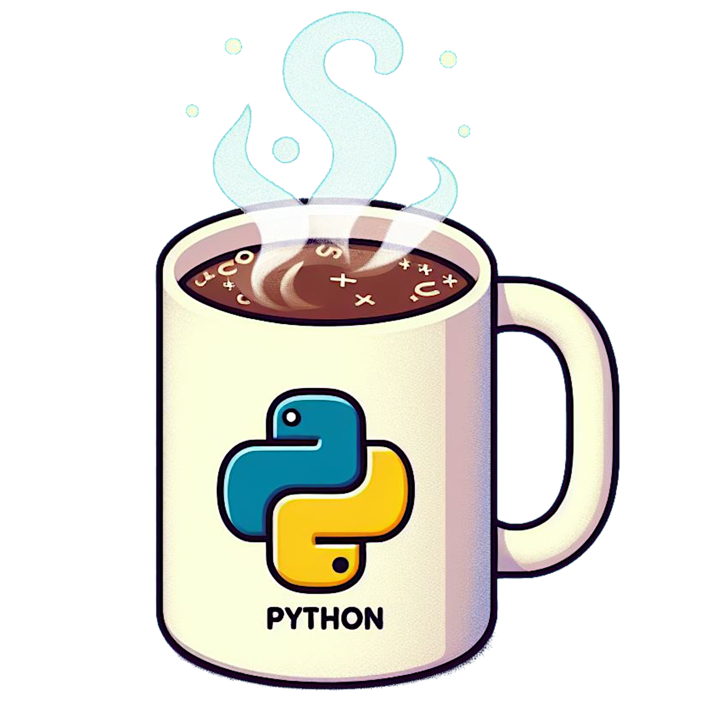

{width="95%" fig-align="center"}

A constantly updated list of resources to improve your Python skills.

## Books

- [Fluent Python](https://www.oreilly.com/library/view/fluent-python-2nd/9781492056348/) by Luciano Ramalho
- [High Performance Python](https://www.oreilly.com/library/view/high-performance-python/9781098165956/) by Micha Gorelick and Ian Ozsvald
- [CPython Internals](https://realpython.com/products/cpython-internals-book/) by Anthony Shaw

## YouTube Channels

- [mCoding](https://www.youtube.com/@mCoding)
- [ArjanCodes](https://www.youtube.com/arjancodes)

## Blogs and Websites

- [Real Python](https://realpython.com/)
- [nietz](https://www.ntietz.com/blog/)
- [Deciphering Glyph](https://blog.glyph.im/)
- [Python Weekly](https://www.pythonweekly.com/)

## Articles

### Design Patterns

- [Stop Writing __init__ Methods](https://blog.glyph.im/2025/04/stop-writing-init-methods.html)
- [The “Active Enum” Pattern](https://blog.glyph.im/2025/01/active-enum.html)

### Python Internals

- [How JIT builds of CPython actually work](https://savannah.dev/posts/how-your-code-runs-in-a-jit-build/)
