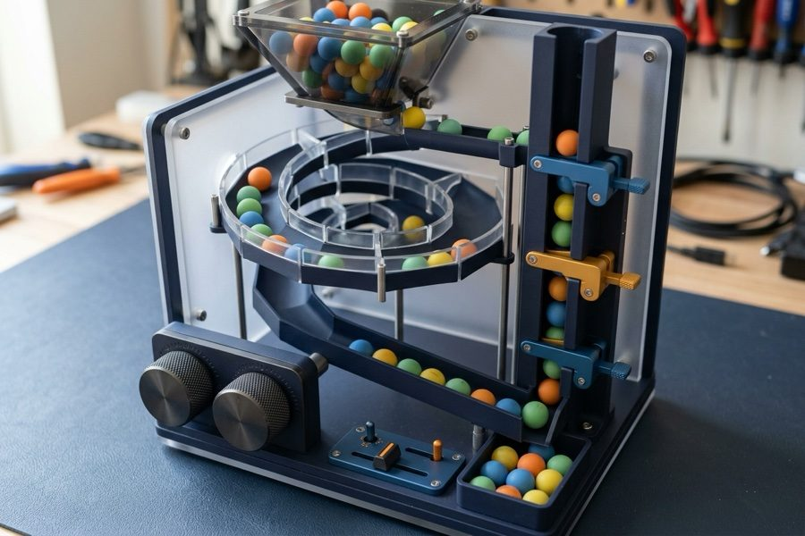

{width="98%" fig-align="center"}

Everyone rolls their eyes at Fibonacci numbers because they're the cliché interview
question nobody uses on a trading desk. But as an autopsy on Python execution speed,
nothing exposes the hidden costs of call-stack frames, object allocation, and
algorithmic complexity quite like it.

Let's take the textbook recursive definition, watch it bring our CPU to its knees for
trivial inputs, and systematically re-engineer it until it runs at hardware limits.

## Naive Recursive Approach

The Fibonacci sequence is defined by the recurrence relation: $F_n = F_{n-1} + F_{n-2}$
with seed values $F_0=0$ and $F_1=1$.

A naive implementation of this in Python is a direct translation of the mathematical
formula:

```{python}
def fibonacci_recursive(n: int) -> int:
    """Calculate the nth Fibonacci number using a recursive approach."""
    if n < 0:
        raise ValueError("Fibonacci is not defined for negative numbers.")
    if n < 2:
        return n
    return fibonacci_recursive(n - 1) + fibonacci_recursive(n - 2)
```

This approach is very intuitive, but it is also very slow. For `n=40`, it already takes
a noticeable amount of time to compute. The reason is that the function calls itself
twice for each `n`, leading to an exponential explosion of stack frames ($O(2^n)$).

```{python}
from time import perf_counter

start = perf_counter()
_ = fibonacci_recursive(40)
end = perf_counter()

print(f"Execution took {end - start:.2f} seconds")
```

## Visualizing the Call Stack

To better understand the problem, let's visualize the call stack. We can create a
"talkative" version of our function that logs every call.

```{python}
from rich.console import Console
from rich.tree import Tree


def fibonacci_recursive_talkative(n: int) -> int:
    """Calculate the nth Fibonacci number using a recursive approach."""
    tree = Tree(f"fibonacci_recursive_talkative({n})")

    def worker(n: int, tree: Tree) -> int:
        """Calculate the nth Fibonacci number using a recursive approach."""
        node = tree.add(f"fibonacci_recursive({n}) called")
        if n < 0:
            raise ValueError("Fibonacci is not defined for negative numbers.")
        if n < 2:
            return n
        return worker(n - 1, node) + worker(n - 2, node)

    result = worker(n, tree)
    Console().print(tree)
    return result
```

For `n=6`, the call tree looks like this:

```{python}
_ = fibonacci_recursive_talkative(6)
```

Look at that tree. To compute $F(6)$, our code evaluates $F(4)$ twice and $F(3)$ three
times. By the time you ask for $F(40)$, Python evaluates over 300 million identical
subtrees from scratch.

What if our function had a memory? Before computing anything, what if it glanced at a
simple lookup table to see if it already solved that exact subproblem?

## Memoization

Storing intermediate results in a dictionary cache transforms this exponential nightmare
into linear execution ($O(n)$). This technique is called memoization:

```{python}
FIBONACCI_CACHE: dict[int, int] = {}


def fibonacci_recursive_cached(n: int) -> int:
    """Calculate the nth Fibonacci number using recursion with memoization."""
    if n < 0:
        raise ValueError("Fibonacci is not defined for negative numbers.")
    if n < 2:
        return n

    if n in FIBONACCI_CACHE:
        return FIBONACCI_CACHE[n]

    result = fibonacci_recursive_cached(n - 1) + fibonacci_recursive_cached(
        n - 2
    )

    FIBONACCI_CACHE[n] = result
    return result
```

This version is much faster. However, it will fail for large `n` (e.g., `n=8_000`)
because of Python's recursion depth limit.

```{python}
try:
    fibonacci_recursive_cached(8_000)
except RecursionError as e:
    print(e)
```

## Decorators for Caching

A more elegant way to implement memoization is by using a decorator. A decorator is a
function that takes another function and extends its behavior without explicitly
modifying it. Python's `functools` module provides a built-in decorator `lru_cache` that
does exactly what we need.

```{python}
from functools import cache


@cache
def fibonacci_recursive_cached_decorator(n: int) -> int:
    """Calculate the nth Fibonacci number using recursion with memoization."""
    if n < 0:
        raise ValueError("Fibonacci is not defined for negative numbers.")
    if n < 2:
        return n
    return fibonacci_recursive_cached_decorator(
        n - 1
    ) + fibonacci_recursive_cached_decorator(n - 2)
```

This is the most concise and Pythonic way to write a cached recursive Fibonacci
function.

## Iterative Approach

Another way to solve the problem is to use an iterative approach. This is equivalent to
tail recursion optimization.

```{python}
def fibonacci_iterative(n: int) -> int:
    """Calculate the nth Fibonacci number using an iterative approach."""
    if n < 0:
        raise ValueError("Fibonacci is not defined for negative numbers.")
    if n < 2:
        return n

    a, b = 0, 1
    for _ in range(n - 1):
        a, b = b, a + b
    return b
```

This is a clean, linear-time $O(n)$ solution with constant $O(1)$ space. As we will see
in the benchmarks, while matrix exponentiation can reduce time complexity to
$O(\log n)$, a tight iterative loop in Python or Numba is hard to beat for practical
integer sizes.

## Performance Comparison

To compare the performance of these implementations, we can use the `perfplot` library.
It allows us to easily benchmark different functions over a range of input sizes.

```{python}
# | code-fold: true
# | code-summary: "Show the code"

import numba
import perfplot
import numpy as np


def fibonacci_internal_cached_decorator(n: int) -> int:
    """Calculate the nth Fibonacci number using recursion with memoization.

    This version uses an internal helper function decorated with @cache.
    This forces the cache to be local to this function.
    """

    @cache
    def helper(n: int) -> int:
        """Calculate the nth Fibonacci number using recursion with memoization."""
        if n < 0:
            raise ValueError("Fibonacci is not defined for negative numbers.")
        if n < 2:
            return n
        return helper(n - 1) + helper(n - 2)

    return helper(n)


fibonacci_iterative_jit = numba.njit(fibonacci_iterative)

_ = fibonacci_iterative_jit(10)  # <1>


def fibonacci_linalg_numpy(n):
    """Calculate the nth Fibonacci number using matrix exponentiation with NumPy."""

    if n <= 0:
        return 0
    if n == 1:
        return 1

    Q = np.array([[1, 1], [1, 0]], dtype=np.uint64)
    result_matrix = np.linalg.matrix_power(Q, n - 1)  # <2>
    return result_matrix[0, 0]
```

1. Warm-up call to trigger JIT compilation before benchmarking.
2. Binary matrix exponentiation reduces theoretical time complexity to $O(\log n)$.

```{python}
# | code-fold: true
# | code-summary: "Show the code"

perfplot.show(
    setup=lambda n: n,
    kernels=[
        fibonacci_recursive,
        fibonacci_internal_cached_decorator,
        fibonacci_iterative,
    ],
    n_range=[i for i in range(1, 16)],
    xlabel="n",
    labels=[
        "recursive",
        "recursive cached",
        "iterative",
    ],
    title="Recursive vs cached vs iterative",
    show_progress=False,
    equality_check=False,
    logx=False,
    logy=True,
)
```

There are more advanced techniques and algorithms to compute Fibonacci numbers, below is
a sneak peek for the future at two more efficient methods: using Numba's JIT compilation
and matrix exponentiation with NumPy.

```{python}
# | code-fold: true
# | code-summary: "Show the code"
perfplot.show(
    setup=lambda n: n,
    kernels=[
        fibonacci_iterative,
        fibonacci_iterative_jit,
        fibonacci_linalg_numpy,
    ],
    n_range=[2**i for i in range(10)],
    xlabel="n",
    labels=[
        "iterative (native)",
        "iterative (numba jit)",
        "matrix (numpy linalg)",
    ],
    equality_check=False,
    show_progress=False,
    logx=False,
    logy=True,
)

```

In the [next post](../25-10-23-python-academy-functions-closures-decorators/), we'll use
these Fibonacci implementations to explore first-class functions, closures, and
decorators.

::: callout-note

Download the full script from the
[Fibonacci optimization case study](../../../assets/python/fibonacci_optimization_and_memoization_case_study.py).

:::
