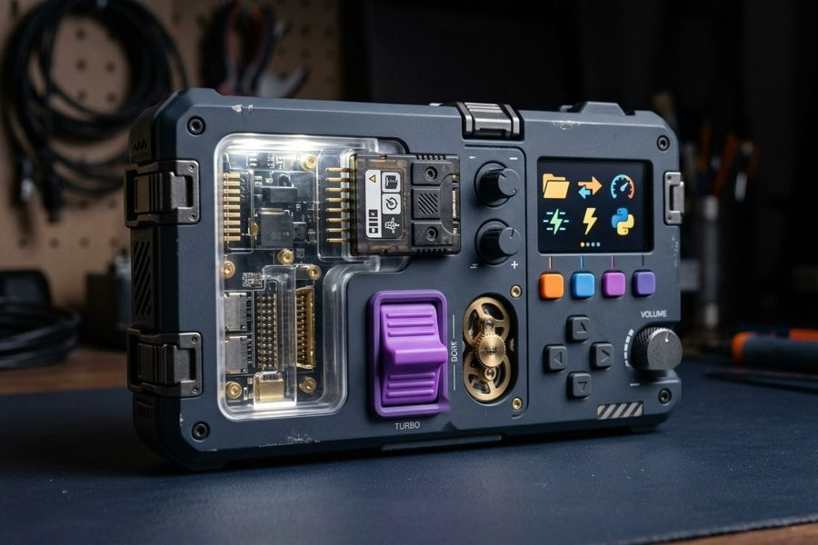

{width="98%" fig-align="center"}

You are about to deploy a pricing service that depends on `pandas==1.5.3`. You download
a teammate's utility script, run `pip install`, and suddenly your core pricing model
throws an `ImportError`. What happened? Your global Python environment just silently
overwritten your production dependencies.

When you first install Python, you get one shared global environment. Sharing that
global site-packages across unrelated projects is an invitation to silent version
conflicts.

Let's look at the classic workflow (`venv` + `pip`), why it breaks down as projects
grow, and how `uv` replaces five disparate tools with a single, deterministic binary.

1. **Version Nightmares:** Project A needs `pandas` version 1.0, but Project B demands
   version 2.0. You can't have both installed globally.
1. **Breaking Your System:** On Linux/macOS, your OS uses Python for its own internal
   tools. If you start messing with global packages, you might accidentally break your
   terminal or system utilities.
1. **Permission Headaches:** Installing globally often screams for `sudo`, which is
   usually a sign you're doing something risky.

Virtual environments are the answer. They let you create isolated sandboxes for every
project. Each sandbox gets its own Python executable and its own set of libraries, so
they never fight over versions.

## Creating and Activating

The standard way to make a sandbox is with `venv`.

To create one named `.venv` (the industry standard name):

```bash
python -m venv .venv
```

You'll see a new `.venv` folder pop up. But it's just sitting there until you
**activate** it.

**On macOS/Linux:**

```bash
source .venv/bin/activate
```

**On Windows:**

```powershell
.venv\Scripts\Activate.ps1
```

Once you see `(.venv)` in your prompt, you're in the sandbox. Anything you install here
stays here.

### Managing Packages with pip

`pip` is your tool for grabbing libraries from the internet (PyPI).

To install something:

```bash
pip install requests
```

To see what you've got:

```bash
pip list
```

### `requirements.txt`

So you've built a cool app. How do you tell your friend exactly which libraries they
need to run it? You hand them a `requirements.txt`.

You can generate this list from your current environment automatically:

```bash
pip freeze > requirements.txt
```

This dumps every installed package and its exact version into a text file.

When your friend grabs your code, they just run:

```bash
pip install -r requirements.txt
```

Now their environment matches your exact pinned package state.

## The Modern Toolchain: uv

While `venv` and `pip` are standard library fixtures, managing multi-package dependency
resolution, cross-platform lockfiles, and Python runtime versions creates constant
developer friction.

`uv`, developed in Rust by Astral, replaces `pip`, `pip-tools`, `virtualenv`, and
`pyenv` with a single, standalone binary that resolves dependencies 10 to 100 times
faster.

### Initializing a Project with uv

Instead of manually creating folders, virtual environments, and requirement files, `uv`
initializes standard project layouts in one step:

```bash
uv init my-project
cd my-project
```

This generates a modern `pyproject.toml` configuration file (the PEP 517/621 standard
that formally replaces legacy `setup.py` and loose `requirements.txt` files).

### Managing Dependencies

With `uv`, you no longer manually run `pip install` and remember to update requirements
files:

```bash
uv add requests
```

In a single operation, `uv`:

1. Resolves the optimal version of `requests`.
2. Installs it (automatically creating a local `.venv` if one does not exist).
3. Updates `pyproject.toml`.
4. Updates `uv.lock`, generating a cryptographically verifiable lockfile for
   reproducible production builds.

### Development Dependencies

When you need tools purely for testing or formatting that should not ship with your
runtime:

```bash
uv add --dev pytest ruff
```

`uv` records these under `[dependency-groups]` in `pyproject.toml`, keeping production
deployment images lean.

### Managing Python Versions

Beyond library packages, `uv` also handles interpreter installation directly without
requiring system-level package managers or `pyenv`:

```bash
uv python install 3.11
uv venv --python 3.11
```

Or you can just pin your project to a specific version, and `uv` will respect that:

```bash
uv python pin 3.12
```

### Packaging: Sharing Your Code

So you've got a project and you want to share it with your colleagues (or the world).
How do you box it up? You build a **Wheel**.

#### What's a Wheel?

A "Wheel" (file extension `.whl`) is the standard way to distribute Python packages.
Think of it as a zip file that's ready to go.

In the old days, we often shared "source distributions" (`.tar.gz`). This meant the
user's computer had to compile any C-extensions or complex code when they installed it.
This was slow and error-prone.

Wheels are **built distributions**. They are pre-compiled and ready to unpack. When you
`pip install pandas`, you're almost certainly downloading a wheel. It's faster, safer,
and easier.

#### The Old Guard: `setuptools`

Traditionally, building a package meant wrestling with a file called `setup.py` using a
library called `setuptools`. This little Python script was where you'd declare
everything about your package: its name, version, author, a brief description, and most
importantly, its dependencies. You'd define which modules to include, any data files,
and even entry points for command-line tools.

It was powerful, for sure, but also notoriously tricky to get right. Debugging
`setup.py` was tedious — you'd write code to describe your package, manage included
files, and handle dependencies. It worked, but slight changes in Python's packaging
standards would often mean revisiting this script.

Here's a super basic `setup.py` example for a package named `my_package`:

```python
# setup.py
from setuptools import setup, find_packages  # <1>

setup(  # <2>
    name="my_package",
    version="0.1.0",
    packages=find_packages(),
    install_requires=[
        "requests",
        "numpy",
    ],
    author="Your Name",
    author_email="your.email@example.com",
    description="A simple example package.",
    long_description=open("README.md").read(),
    long_description_content_type="text/markdown",
    url="https://github.com/yourusername/my_package",
    classifiers=[
        "Programming Language :: Python :: 3",
        "License :: OSI Approved :: MIT License",
        "Operating System :: OS Independent",
    ],
    python_requires=">=3.8",
)
```

1. Import necessary setuptools utilities.
1. The setup function defines package metadata and requirements.

And to build your package (both source and wheel distributions) using this file, you'd
run:

```bash
python setup.py sdist bdist_wheel
```

#### The New Way: uv build

Since `uv` already knows everything about your project from `pyproject.toml`, building a
package is laughably simple. You don't need a `setup.py` anymore.

Just run:

```bash
uv build
```

That's it. `uv` will look at your `pyproject.toml`, gather your code, and spit out a
shiny `.whl` file (and a `.tar.gz` source distribution just in case) into a `dist/`
folder. You can then upload these to PyPI or share them directly.

### Conclusion

| Feature       | Classic (`venv` + `pip`)        | Modern (`uv`)                 |
| :------------ | :------------------------------ | :---------------------------- |
| **Creation**  | `python -m venv .venv`          | `uv init` / auto-created      |
| **Install**   | `pip install pkg`               | `uv add pkg`                  |
| **Save Deps** | `pip freeze > requirements.txt` | Automatic in `pyproject.toml` |
| **Dev Deps**  | Manual separation               | `uv add --dev pkg`            |
| **Speed**     | Standard                        | Sub-second (Rust resolver)    |

Understanding `venv` and `pip` is useful background — it's how we did things for a long
time. But once you try `uv`, you won't want to go back.
